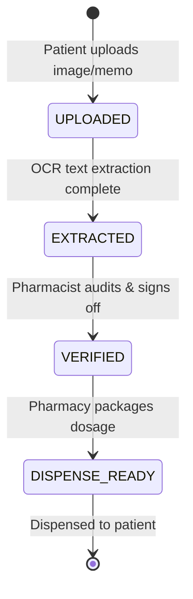
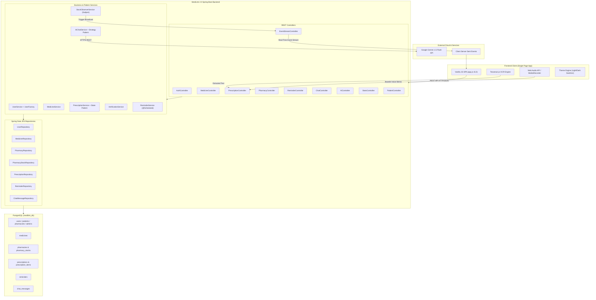

# MediLink 2.0: Smart Emergency Medicine & Health Assistant

[](https://www.oracle.com/java/)
[](https://spring.io/projects/spring-boot)
[](https://www.postgresql.org/)
[](https://maven.apache.org/)
[](https://spring.io/)
[](https://ai.google.dev/)
[](https://tesseract.projectnaptha.com/)
[-red?style=for-the-badge)](https://github.com/)

> **Advanced Object-Oriented Programming (AOOP) Capstone Project — 12th Semester**  
> An enterprise-grade, resilient healthcare management and emergency assistant platform tailored for the prescription, pharmacy inventory, and counterfeit medicine verification ecosystem in Bangladesh.

---

## 📑 Table of Contents
- [🌟 Executive Summary](#-executive-summary)
- [✨ Core Capabilities & Feature Modules](#-core-capabilities--feature-modules)
- [📐 Advanced OOP Architecture & GoF Design Patterns](#-advanced-oop-architecture--gof-design-patterns)
  - [1. Factory Pattern](#1-factory-pattern)
  - [2. Observer Pattern & SSE Streaming](#2-observer-pattern--sse-streaming)
  - [3. Strategy Pattern](#3-strategy-pattern)
  - [4. State Pattern](#4-state-pattern)
  - [5. Decorator Pattern](#5-decorator-pattern)
  - [6. Polymorphic JPA Inheritance (JOINED)](#6-polymorphic-jpa-inheritance-joined)
  - [7. Singleton Pattern & Spring IoC Scoping](#7-singleton-pattern--spring-ioc-scoping)
  - [8. Multithreading & Scheduled Daemon Processing](#8-multithreading--scheduled-daemon-processing)
- [🏗️ System Architecture & Data Flow](#️-system-architecture--data-flow)
- [🔌 Complete REST API Reference](#-complete-rest-api-reference)
- [🗄️ Database Schema & Auto-Seeding](#️-database-schema--auto-seeding)
- [🚀 Prerequisites & Getting Started](#-prerequisites--getting-started)
  - [Environment Variables](#environment-variables)
  - [Running the Application](#running-the-application)
- [👥 Demo User Credentials](#-demo-user-credentials)
- [📂 Project Directory Structure](#-project-directory-structure)
- [🧪 Verification & Testing](#-verification--testing)
- [📜 Academic Attribution & License](#-academic-attribution--license)

---

## 🌟 Executive Summary

**MediLink 2.0** solves critical challenges in the pharmaceutical supply and patient healthcare ecosystem of Bangladesh:
1. **Medicine Affordability & Transparency**: Patients struggle to identify generic alternatives and face arbitrary price variations across retail pharmacies.
2. **Counterfeit Drug Epidemic**: The proliferation of counterfeit or unverified medicines puts lives at risk. MediLink 2.0 integrates official **Directorate General of Drug Administration (DGDA)** batch verification.
3. **Drug Safety & Drug-Drug Interactions**: Patients taking multiple prescription medications are vulnerable to dangerous adverse interactions, paracetamol hepatotoxicity, and CYP-enzyme contraindications.
4. **Prescription Inefficiencies**: Illegible physical prescriptions cause dispensing errors. MediLink provides digital scanning via **Tesseract.js OCR**, attached **voice memos**, and state-managed pharmacist verification.
5. **Emergency Response**: Instant identification of 24/7 pharmacies in Dhaka using geospatial math (Haversine formula), real-time stock broadcasts via Server-Sent Events (SSE), and direct emergency hotline dispatch.

---

## ✨ Core Capabilities & Feature Modules

| Module | Features & Capabilities | Underlying Technology |
| :--- | :--- | :--- |
| **Multi-Role Portal** | Distinct dashboard layouts, permissions, and metric summaries for **Patients**, **Pharmacists**, and **Administrators**. | Factory Pattern, Polymorphic JPA |
| **Smart Medicine Finder** | Search brand names, generic formulations, and identify therapeutic alternatives across major Bangladeshi pharmaceuticals (Beximco, Square, Incepta, Renata, Acme). | Strategy Pattern (`MedicineSearchStrategy`) |
| **Cross-Pharmacy Price Comparison** | Compares retail prices across verified Dhaka pharmacies (Lazz Pharma, Tamanna, Green Pharma, etc.) and highlights best savings. | Strategy Pattern (`PriceSearchStrategy`) |
| **Drug-Drug Interaction Engine** | Evaluates contraindications, synergistic toxicity, and duplicate therapies in both **Standard Warning** and **Clinical Strict** modes. | Strategy Pattern (`InteractionCheckStrategy`) |
| **Digital Prescription Scanner** | Browser-side client OCR using **Tesseract.js v5**, automated medicine token extraction, manual doctor/clinic overrides, and attached **Audio Voice Memos** (Web Audio API / MediaRecorder). | Tesseract.js, Regex Tokenizer, HTML5 Audio |
| **Prescription Lifecycle Workflow** | Multi-phase prescription progression: `UPLOADED` $\rightarrow$ `EXTRACTED` $\rightarrow$ `VERIFIED` $\rightarrow$ `DISPENSE_READY` with pharmacist sign-off. | State Pattern (`PrescriptionState`), JPA `@PostLoad` |
| **Anti-Counterfeit Medicine Verifier** | DGDA batch code verification, QR/barcode scanning simulation, manufacturer validation, and counterfeit alert generation. | Verification Strategy & Repository Lookup |
| **Live Pharmacy Inventory** | Pharmacists adjust stock in real-time; changes trigger instant reactive pushes to connected clients without browser refresh. | Observer Pattern, Spring `SseEmitter` |
| **24/7 Emergency Pharmacy Locator** | Real-time Haversine distance calculations from patient coordinates to open pharmacies across Dhaka, with direct emergency call links. | Haversine Formula, Geolocation API |
| **Medication & Appointment Reminders** | Daily dosage schedules, frequency configuration (Once, Daily, Twice Daily, Weekly), background daemon polling, and instant test alarm triggers. | Spring `@Scheduled`, `@EnableScheduling` |
| **24/7 Gemini AI Clinical Assistant** | Context-aware AI chatbot powered by **Google Gemini 1.5 Flash** with multi-lingual auto-detection (Bangla, English, Arabic, Spanish, French, Urdu) and offline **Local Clinical Fallback**. | Strategy Pattern (`AiChatStrategy`), Gemini REST API |
| **Pharmacist Live Chat** | Real-time consultation chat between patients and licensed pharmacists, with full message history persisted in PostgreSQL. | JPA Persistence, REST API |
| **Interactive Help & Support** | Searchable knowledge base, FAQs, and a ticketing system with category selection, severity rating, and file attachments. | Dynamic SPA Subviews |
| **Modern Glassmorphic UI/UX** | Responsive layouts, dual-panel sliding authentication modal, interactive country flag dial-code selector, password strength meter, and Dark/Light mode with `Ctrl+Shift+D`. | Vanilla CSS Variables, Vanilla JS SPA |

---

## 📐 Advanced OOP Architecture & GoF Design Patterns

MediLink 2.0 was developed for the **Advanced Object-Oriented Programming (AOOP)** course, demonstrating rigorous adherence to SOLID principles, design patterns, and clean code architecture.

```
com.medilink
├── config/        # Spring MVC, CORS, and DataSeeder initializers
├── controller/    # REST API endpoints (10 Controllers)
├── model/         # Core Domain Models, Entities, and OOP Patterns
│   ├── chat/      # Chat message models
│   ├── medicine/  # Medicine domain, Decorator pattern classes
│   ├── observer/  # Observer pattern Subject and Notifiable interfaces
│   ├── pharmacy/  # Pharmacy and stock models
│   ├── prescription/ # Prescription entity and State pattern hierarchy
│   ├── reminder/  # Medication reminder models
│   ├── strategy/  # Search, Interaction, Verification, and AI Strategies
│   └── user/      # User hierarchy, UserFactory, Role enums
├── repository/    # Spring Data JPA interfaces
└── service/       # Business logic services and thread-safe singletons
```

---

### 1. Factory Pattern
- **Interface & Classes**: [`UserFactory.java`](file:///d:/ACADEMIC%20CAREER/12th%20Semester/Advance%20OOP/Medilink2.0/src/main/java/com/medilink/model/user/UserFactory.java) $\rightarrow$ [`Patient.java`](file:///d:/ACADEMIC%20CAREER/12th%20Semester/Advance%20OOP/Medilink2.0/src/main/java/com/medilink/model/user/Patient.java), [`Pharmacist.java`](file:///d:/ACADEMIC%20CAREER/12th%20Semester/Advance%20OOP/Medilink2.0/src/main/java/com/medilink/model/user/Pharmacist.java), [`Admin.java`](file:///d:/ACADEMIC%20CAREER/12th%20Semester/Advance%20OOP/Medilink2.0/src/main/java/com/medilink/model/user/Admin.java)
- **Role**: Decouples user object instantiation from authentication and registration controllers.
- **Implementation**:
  ```java
  public class UserFactory {
      public static User createUser(UserRole role, String name, String email, String password, Map<String, Object> extra) {
          switch (role) {
              case PATIENT:
                  return new Patient(id, name, email, password, phone, bloodType, allergies, chronicConditions, emergencyContact);
              case PHARMACIST:
                  return new Pharmacist(id, name, email, password, pharmacyName, licenseNumber);
              case ADMIN:
                  return new Admin(id, name, email, password, department);
              default:
                  throw new IllegalArgumentException("Unsupported user role: " + role);
          }
      }
  }
  ```

---

### 2. Observer Pattern & SSE Streaming
- **Interfaces & Classes**: [`Subject.java`](file:///d:/ACADEMIC%20CAREER/12th%20Semester/Advance%20OOP/Medilink2.0/src/main/java/com/medilink/model/observer/Subject.java), [`Notifiable.java`](file:///d:/ACADEMIC%20CAREER/12th%20Semester/Advance%20OOP/Medilink2.0/src/main/java/com/medilink/model/observer/Notifiable.java), [`PharmacyStock.java`](file:///d:/ACADEMIC%20CAREER/12th%20Semester/Advance%20OOP/Medilink2.0/src/main/java/com/medilink/model/pharmacy/PharmacyStock.java), [`StockObserverService.java`](file:///d:/ACADEMIC%20CAREER/12th%20Semester/Advance%20OOP/Medilink2.0/src/main/java/com/medilink/service/StockObserverService.java), [`EventStreamController.java`](file:///d:/ACADEMIC%20CAREER/12th%20Semester/Advance%20OOP/Medilink2.0/src/main/java/com/medilink/controller/EventStreamController.java)
- **Role**: Implements loose coupling for real-time inventory and prescription notifications.
- **Workflow**:
  1. `PharmacyStock` implements `Subject` and maintains a list of `Notifiable` observers.
  2. When quantity changes via `/api/pharmacies/stocks`, `notifyObservers()` fires.
  3. `StockObserverService` captures the event and broadcasts it to connected HTTP clients via Spring `SseEmitter` at `/api/events/stream`.
  4. The frontend listener receives the SSE stream and displays live toast notifications across all active sessions.

---

### 3. Strategy Pattern
The Strategy pattern is utilized across four domains to allow algorithmic interchangeability at runtime:

#### A. Medicine Search Strategies
- **Base Interface**: [`MedicineSearchStrategy.java`](file:///d:/ACADEMIC%20CAREER/12th%20Semester/Advance%20OOP/Medilink2.0/src/main/java/com/medilink/model/strategy/MedicineSearchStrategy.java)
- **Concrete Strategies**:
  - `BrandSearchStrategy`: Matches queries against pharmaceutical brand names (`Napa Extra`, `Seclo`).
  - `GenericSearchStrategy`: Filters medicines by generic active molecules (`Paracetamol`, `Omeprazole`).
  - `PriceSearchStrategy`: Sorts matching medicines ascending by price to find cost-effective options.

#### B. Clinical Drug Interaction Strategies
- **Base Interface**: [`InteractionCheckStrategy.java`](file:///d:/ACADEMIC%20CAREER/12th%20Semester/Advance%20OOP/Medilink2.0/src/main/java/com/medilink/model/strategy/InteractionCheckStrategy.java)
- **Concrete Strategies**:
  - `StandardWarningStrategy`: Checks common high-level conflicts and duplicate drug classes.
  - `ClinicalStrictStrategy`: Evaluates hepatic toxicity thresholds, NSAID combinations, and severe contraindications.

#### C. AI Healthcare Assistant Strategies
- **Base Interface**: [`AiChatStrategy.java`](file:///d:/ACADEMIC%20CAREER/12th%20Semester/Advance%20OOP/Medilink2.0/src/main/java/com/medilink/model/strategy/AiChatStrategy.java)
- **Concrete Strategies**:
  - `GeminiAiStrategy`: Communicates with Google's Gemini 1.5 Flash API with patient context injection and multilingual auto-detection.
  - `LocalClinicalFallbackStrategy`: Offline, rule-based medical expert system used when API keys are absent or network is unavailable.

#### D. Medicine Batch Verification Strategies
- **Base Interface**: [`MedicineVerificationStrategy.java`](file:///d:/ACADEMIC%20CAREER/12th%20Semester/Advance%20OOP/Medilink2.0/src/main/java/com/medilink/model/strategy/MedicineVerificationStrategy.java)
- **Concrete Strategies**:
  - `DgdaBatchVerificationStrategy`: Verifies production lots against official manufacturer batches.
  - `BarcodeVerificationStrategy`: Validates GS1/QR barcodes for tamper-detection.

---

### 4. State Pattern
- **Interface & Classes**: [`PrescriptionState.java`](file:///d:/ACADEMIC%20CAREER/12th%20Semester/Advance%20OOP/Medilink2.0/src/main/java/com/medilink/model/prescription/PrescriptionState.java), [`UploadedState.java`](file:///d:/ACADEMIC%20CAREER/12th%20Semester/Advance%20OOP/Medilink2.0/src/main/java/com/medilink/model/prescription/UploadedState.java), [`ExtractedState.java`](file:///d:/ACADEMIC%20CAREER/12th%20Semester/Advance%20OOP/Medilink2.0/src/main/java/com/medilink/model/prescription/ExtractedState.java), [`VerifiedState.java`](file:///d:/ACADEMIC%20CAREER/12th%20Semester/Advance%20OOP/Medilink2.0/src/main/java/com/medilink/model/prescription/VerifiedState.java), [`DispenseReadyState.java`](file:///d:/ACADEMIC%20CAREER/12th%20Semester/Advance%20OOP/Medilink2.0/src/main/java/com/medilink/model/prescription/DispenseReadyState.java)
- **Entity**: [`Prescription.java`](file:///d:/ACADEMIC%20CAREER/12th%20Semester/Advance%20OOP/Medilink2.0/src/main/java/com/medilink/model/prescription/Prescription.java)
- **Role**: Encapsulates clinical validation rules for prescription state transitions.
- **JPA Synchronization**: The `@Transient` state object is dynamically rebuilt on entity load via `@PostLoad` based on the persistent `status` column, ensuring smooth integration between the GoF pattern and Hibernate ORM.



---

### 5. Decorator Pattern
- **Abstract Decorator**: [`MedicineBadgeDecorator.java`](file:///d:/ACADEMIC%20CAREER/12th%20Semester/Advance%20OOP/Medilink2.0/src/main/java/com/medilink/model/medicine/MedicineBadgeDecorator.java) (extends `Medicine`)
- **Concrete Decorators**:
  - `VerifiedBadgeDecorator`: Appends `[✓ DGDA VERIFIED GENUINE]` regulatory compliance badge.
  - `LowStockBadgeDecorator`: Appends `[⚠️ LOW INVENTORY ALERT]` warning flag.
- **Role**: Dynamically attaches visual metadata and regulatory indicators to `Medicine` objects at runtime without subclass explosion.

---

### 6. Polymorphic JPA Inheritance (JOINED)
- **Base Entity**: [`User.java`](file:///d:/ACADEMIC%20CAREER/12th%20Semester/Advance%20OOP/Medilink2.0/src/main/java/com/medilink/model/user/User.java) annotated with `@Inheritance(strategy = InheritanceType.JOINED)`
- **Subclasses**: `Patient`, `Pharmacist`, `Admin`
- **Database Tables**:
  - `users`: Contains shared attributes (`id`, `name`, `email`, `password`, `phone`, `role`, `custom_avatar`).
  - `patients`: Joined by `user_id`, holds medical data (`blood_type`, `allergies`, `chronic_conditions`, `emergency_contacts_json`).
  - `pharmacists`: Joined by `user_id`, stores credential data (`pharmacy_name`, `license_number`).
  - `admins`: Joined by `user_id`, stores administrative info (`department`).
- **Advantage**: Preserves third normal form (3NF) relational integrity while enabling polymorphic OOP querying via `UserRepository.findAll()`.

---

### 7. Singleton Pattern & Spring IoC Scoping
- Core services (`StockObserverService`, `AiChatService`, `VerificationService`) provide a thread-safe static `getInstance()` method while integrating seamlessly with Spring's `@Service` singleton application context.
- Guarantees centralized state management for observer listener pools, active SSE channels, and global AI configuration.

---

### 8. Multithreading & Scheduled Daemon Processing
- **Class**: [`ReminderService.java`](file:///d:/ACADEMIC%20CAREER/12th%20Semester/Advance%20OOP/Medilink2.0/src/main/java/com/medilink/service/ReminderService.java)
- **Configuration**: Enabled via `@EnableScheduling` in `MedilinkApplication.java`.
- **Mechanism**:
  ```java
  @Scheduled(fixedRate = 60000) // Executes every 60 seconds
  public void checkAndTriggerReminders() {
      // Background thread scans database for active dosage alerts
      // Broadcasts notification alerts to active patients via StockObserverService
  }
  ```

---

## 🏗️ System Architecture & Data Flow



---

## 🔌 Complete REST API Reference

### 1. Authentication & User Management
| Method | Endpoint | Description | Request Body / Query |
| :--- | :--- | :--- | :--- |
| `POST` | `/api/auth/login` | Authenticate user (Patient, Pharmacist, Admin) | `{"email": "...", "password": "..."}` |
| `POST` | `/api/auth/register` | Register user via `UserFactory` | `{"name": "...", "email": "...", "password": "...", "role": "PATIENT", ...}` |
| `POST` | `/api/auth/send-otp` | Generate verification OTP | `{"email": "..."}` |
| `POST` | `/api/auth/verify-otp` | Validate user OTP | `{"email": "...", "otp": "..."}` |
| `GET` | `/api/patient/profile` | Retrieve patient clinical profile | Query: `?id=...` or `?email=...` |
| `POST` | `/api/patient/profile` | Update medical profile & emergency contacts | `{"id": "...", "bloodType": "...", "allergies": "...", ...}` |

### 2. Medicines, Alternatives & Anti-Counterfeit Verification
| Method | Endpoint | Description | Request Body / Query |
| :--- | :--- | :--- | :--- |
| `GET` | `/api/medicines` | Retrieve catalog of all medicines | — |
| `GET` | `/api/medicines/search` | Search via Strategy (`brand`, `generic`, `price`) | Query: `?query=napa&strategy=brand` |
| `GET` | `/api/medicines/alternatives` | Find alternative brands with the same generic molecule | Query: `?generic=Paracetamol&excludeBrand=Napa` |
| `GET` | `/api/medicines/compare-prices`| Compare live pharmacy prices across Dhaka | Query: `?medicine=Napa+Extra` |
| `POST` | `/api/medicines/interaction-check` | Evaluate drug-drug interactions | `{"medicines": "Napa Extra, Ace Plus", "mode": "CLINICAL"}` |
| `POST` | `/api/medicines/verify` | Verify medicine authenticity against DGDA records | `{"medicineId": "med_01", "code": "BEX-2026-A1"}` |

### 3. Prescriptions & Clinical Lifecycle
| Method | Endpoint | Description | Request Body / Query |
| :--- | :--- | :--- | :--- |
| `GET` | `/api/prescriptions` | Get all active prescriptions | — |
| `POST` | `/api/prescriptions/upload` | Upload new prescription with OCR text and audio memo | `{"patientId": "...", "doctorName": "...", "scanText": "...", "voiceNoteAudio": "..."}` |
| `POST` | `/api/prescriptions/advance` | Advance workflow status (State Pattern transition) | `{"prescriptionId": "rx_01"}` |
| `POST` | `/api/prescriptions/delete` | Remove prescription record and notify observers | `{"prescriptionId": "rx_01"}` |

### 4. Pharmacy, Stock & Real-Time Observer Events
| Method | Endpoint | Description | Request Body / Query |
| :--- | :--- | :--- | :--- |
| `GET` | `/api/pharmacies` | List all verified partner pharmacies | — |
| `GET` | `/api/pharmacies/emergency` | Find 24/7 pharmacies sorted by distance | Query: `?lat=23.7465&lng=90.3760` |
| `GET` | `/api/pharmacies/stocks` | Retrieve inventory levels across all stores | — |
| `POST` | `/api/pharmacies/stocks` | Update stock quantity and broadcast to observers | `{"stockId": "stk_01", "quantity": 45}` |
| `GET` | `/api/events/stream` | Real-time Server-Sent Events (SSE) stream | Produces: `text/event-stream` |

### 5. Medication Reminders & Dosage Scheduler
| Method | Endpoint | Description | Request Body / Query |
| :--- | :--- | :--- | :--- |
| `GET` | `/api/reminders` | Retrieve active reminders | — |
| `POST` | `/api/reminders/create` | Schedule appointment or dose reminder | `{"medicine": "Seclo 20", "dosage": "1 Cap", "time": "08:00", "frequency": "DAILY", ...}` |
| `GET` | `/api/reminders/test-alert`| Trigger instant test alarm via SSE broadcast | — |

### 6. Pharmacist Live Chat & Gemini AI Assistant
| Method | Endpoint | Description | Request Body / Query |
| :--- | :--- | :--- | :--- |
| `GET` | `/api/chat/messages` | Fetch consultation chat history | Query: `?user1=usr_patient_01&user2=usr_pharma_01` |
| `POST` | `/api/chat/send` | Send real-time chat message | `{"senderId": "...", "receiverId": "...", "content": "..."}` |
| `POST` | `/api/ai/chat` | Query AI Clinical Assistant (Gemini / Fallback) | `{"message": "...", "apiKey": "...", "patientId": "..."}` |
| `GET` | `/api/ai/status` | Check AI engine configuration and active strategy | — |

### 7. Telemetry & Analytics
| Method | Endpoint | Description |
| :--- | :--- | :--- |
| `GET` | `/api/stats` | Returns real-time usage statistics (active users, pharmacies, prescriptions, reminders) |

---

## 🗄️ Database Schema & Auto-Seeding

MediLink 2.0 uses **PostgreSQL**. Tables are defined in [`medilink_schema.sql`](file:///d:/ACADEMIC%20CAREER/12th%20Semester/Advance%20OOP/Medilink2.0/medilink_schema.sql) and auto-seeded by [`DataSeeder.java`](file:///d:/ACADEMIC%20CAREER/12th%20Semester/Advance%20OOP/Medilink2.0/src/main/java/com/medilink/config/DataSeeder.java) on application boot if empty.

### Relational Schema Summary
- **`users`**: Base table for joined inheritance (`id`, `name`, `email`, `password`, `phone`, `role`, `custom_avatar`, `created_at`).
- **`patients`**: Child table (`user_id` FK, `date_of_birth`, `gender`, `blood_type`, `allergies`, `chronic_conditions`, `emergency_contact`, `emergency_contacts_json`).
- **`pharmacists`**: Child table (`user_id` FK, `pharmacy_name`, `license_number`).
- **`admins`**: Child table (`user_id` FK, `department`).
- **`medicines`**: Comprehensive medicine catalog (`id`, `brand_name`, `generic_name`, `company`, `strength`, `formulation`, `unit_price`, `prescription_required`, `category`, `side_effects`, `valid_batch_codes`).
- **`pharmacies`**: Partner pharmacies (`id`, `name`, `address`, `area`, `phone`, `is_24_hours`, `latitude`, `longitude`).
- **`pharmacy_stocks`**: Inventory junction (`id`, `pharmacy_id`, `medicine_id`, `quantity`, `unit_price`, `last_updated`).
- **`prescriptions`**: Master prescription record (`id`, `patient_id`, `doctor_name`, `hospital_or_clinic`, `raw_scan_text`, `status`, `voice_note_audio`, `dispense_ready`, `created_at`).
- **`prescription_items`**: Extracted line items (`id`, `prescription_id` FK, `medicine_id`, `medicine_name`, `dosage`, `frequency`, `duration`, `instructions`).
- **`reminders`**: Patient schedules (`id`, `patient_id`, `medicine_name`, `dosage`, `reminder_time`, `frequency`, `instructions`, `active`).
- **`chat_messages`**: Consultation logs (`id`, `sender_id`, `sender_name`, `sender_role`, `receiver_id`, `content`, `timestamp`).

---

## 🚀 Prerequisites & Getting Started

### Prerequisites
1. **Java Development Kit (JDK)**: JDK 8, 11, 17, or 21 installed.
2. **PostgreSQL**: Running locally on port `5433` (or standard `5432`) with a database named `medilink_db`.
3. **Apache Maven**: Version 3.8+ (automatically resolved if using the bundled scripts).

---

### Environment Variables

| Variable | Default Value | Description |
| :--- | :--- | :--- |
| `DB_URL` | `jdbc:postgresql://localhost:5433/medilink_db` | PostgreSQL JDBC connection URL |
| `DB_PORT` | `5433` | Port where PostgreSQL is running |
| `DB_USERNAME` | `postgres` | Database username |
| `DB_PASSWORD` | `postgres` | Database user password |
| `SERVER_PORT` | `8080` | Application HTTP port |
| `GEMINI_API_KEY` | *(Optional)* | Google Gemini AI API key (can also be supplied in UI) |

---

### Running the Application

#### Option 1: PowerShell Script (Recommended for Windows)
```powershell
.\run.ps1
```
*The script checks your PostgreSQL service, tests port availability, configures environment variables, and launches the Spring Boot application.*

#### Option 2: Windows Batch Script
```cmd
build_and_run.bat
```

#### Option 3: Standard Maven Command
```powershell
$env:DB_PORT="5433"
$env:DB_PASSWORD="your_postgres_password"
mvn spring-boot:run
```

#### Option 4: Building Production Executable JAR
```bash
mvn clean package -DskipTests
java -jar target/medilink-2.0.0.jar
```

Once started, access the application in your browser:
👉 **`http://localhost:8080`**

---

## 👥 Demo User Credentials

Pre-seeded accounts are available for testing role-specific features:

| Role | Name | Email Address | Password | Key Test Capabilities |
| :--- | :--- | :--- | :--- | :--- |
| **Patient** | Rahim Ahmed | `rahim@medilink.com` | `patient123` | Prescription scanning, price comparison, drug interaction checks, dosage reminders, AI consultation, emergency mode. |
| **Pharmacist** | Dr. Farhan Kabir | `farhan@lazzpharma.com` | `pharma123` | Prescription verification workflow, stock adjustment with live Observer broadcast, patient chat consultation. |
| **Administrator** | System Admin | `admin@medilink.com` | `admin123` | System telemetry, user management, audit logs, emergency network monitoring. |

---

## 📂 Project Directory Structure

```
d:\ACADEMIC CAREER\12th Semester\Advance OOP\Medilink2.0
├── pom.xml                                   # Maven dependencies & build configuration
├── medilink_schema.sql                       # Full PostgreSQL database schema DDL
├── run.ps1                                   # Automated launch script for PowerShell
├── build_and_run.bat                         # Automated batch build runner
├── README.md                                 # Complete project documentation
├── src
│   ├── main
│   │   ├── java
│   │   │   └── com
│   │   │       └── medilink
│   │   │           ├── MedilinkApplication.java  # Spring Boot Main Entrypoint
│   │   │           ├── config/
│   │   │           │   ├── DataSeeder.java       # Database seed data initializer
│   │   │           │   └── WebMvcConfig.java     # CORS & Static resource handler config
│   │   │           ├── controller/               # 10 REST API Controllers
│   │   │           ├── model/
│   │   │           │   ├── chat/ChatMessage.java
│   │   │           │   ├── medicine/             # Medicine & Decorator pattern classes
│   │   │           │   ├── observer/             # Observer pattern Subject & Notifiable
│   │   │           │   ├── pharmacy/             # Pharmacy & PharmacyStock
│   │   │           │   ├── prescription/         # Prescription & State pattern hierarchy
│   │   │           │   ├── reminder/             # Reminder entity & frequency enums
│   │   │           │   ├── strategy/             # Search, Interaction, Verification & AI strategies
│   │   │           │   └── user/                 # User inheritance hierarchy & UserFactory
│   │   │           ├── repository/               # Spring Data JPA Repository Interfaces
│   │   │           └── service/                  # Business logic services & Singletons
│   │   └── resources
│   │       ├── application.properties        # Application configuration & DB properties
│   │       └── static                        # Web SPA Frontend
│   │           ├── index.html                # Unified Single Page Application UI
│   │           ├── style.css                 # Glassmorphic responsive styling & theme variables
│   │           ├── app.js                    # Core frontend controllers, OCR & SSE client
│   │           └── flags/                    # SVG national flag assets for country selector
│   └── test
│       └── java
│           └── com
│               └── medilink
│                   └── MedilinkApplicationTests.java # Context & smoke test suite
```

---

## 🧪 Verification & Testing

### Running Automated Tests
```powershell
mvn test
```

### Manual Verification Checklist
1. **Authentication Flow**:
   - Test Sign In as Patient (`rahim@medilink.com` / `patient123`).
   - Switch roles to Pharmacist or Admin directly from the sliding modal.
   - Test validation of password strength meter and international dial-code picker.
2. **Prescription OCR & Voice Memos**:
   - Navigate to **Prescriptions & Meds** $\rightarrow$ **Upload Prescription**.
   - Select an image or click sample presets. Observe Tesseract.js extract dosage instructions.
   - Record an audio voice note via your microphone, preview playback, and upload.
3. **Live Inventory & Observer Pattern**:
   - Open two browser tabs side-by-side.
   - On Tab 1 (Pharmacist): Navigate to **Live Stock Broadcast** and change the quantity of *Napa Extra* to `5`.
   - On Tab 2 (Patient): Observe the real-time toast alert push received through Server-Sent Events without refreshing the page!
4. **Drug Interaction Checker**:
   - Check *Napa Extra* and *Ace Plus* together.
   - Verify the engine triggers a severe **Paracetamol Duplicate Therapy Warning**.
5. **Counterfeit Batch Verifier**:
   - Navigate to **Fake Medicine Verifier**.
   - Input valid batch code `BEX-2026-A1` (Authentic Beximco batch).
   - Input invalid code `FAKE-999` (Counterfeit warning triggered).
6. **Gemini AI Healthcare Chatbot**:
   - Type a query in English, Bengali (*"আমার মাথায় খুব ব্যথা, কি ওষুধ খাবো?"*), or Arabic.
   - Verify the model detects the language and responds in the same language.

---

## 📜 Academic Attribution & License

- **Course**: Advanced Object-Oriented Programming (AOOP) — 12th Semester Capstone Project
- **Project Lead / Author**: Hasin Jubaier & MediLink Development Team
- **Institution**: Department of Computer Science & Engineering
- **License**: Licensed under the [MIT License](LICENSE). Educational and clinical reference platform.
