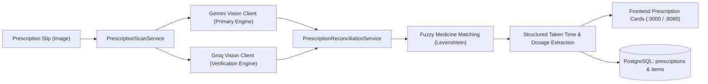

# MediLink 2.0: Smart Emergency Medicine & Health Assistant

[](https://www.oracle.com/java/)
[](https://spring.io/projects/spring-boot)
[](https://www.postgresql.org/)
[](https://maven.apache.org/)
[](https://spring.io/)
[](https://ai.google.dev/)
[](https://groq.com/)
[](https://tesseract.projectnaptha.com/)
[-red?style=for-the-badge)](https://github.com/)

> **Advanced Object-Oriented Programming (AOOP) Capstone Project — 12th Semester**  
> An enterprise-grade, resilient healthcare management and emergency assistant platform tailored for the prescription, pharmacy inventory, and counterfeit medicine verification ecosystem in Bangladesh.

---

## 📑 Table of Contents
- [🌟 Executive Summary](#-executive-summary)
- [✨ Core Capabilities & Feature Modules](#-core-capabilities--feature-modules)
- [🤖 Dual-Engine AI Vision Prescription Scanner](#-dual-engine-ai-vision-prescription-scanner)
- [📈 Bangladesh Medicine Market Price Synchronization](#-bangladesh-medicine-market-price-synchronization)
- [📐 Advanced OOP Architecture & GoF Design Patterns](#-advanced-oop-architecture--gof-design-patterns)
  - [1. Factory Pattern](#1-factory-pattern)
  - [2. Observer Pattern & SSE Streaming](#2-observer-pattern--sse-streaming)
  - [3. Strategy Pattern](#3-strategy-pattern)
  - [4. State Pattern](#4-state-pattern)
  - [5. Decorator Pattern](#5-decorator-pattern)
  - [6. Polymorphic JPA Inheritance (JOINED)](#6-polymorphic-jpa-inheritance-joined)
  - [7. Singleton Pattern & Spring IoC Scoping](#7-singleton-pattern--spring-ioc-scoping)
  - [8. Multithreading & Scheduled Daemon Processing](#8-multithreading--scheduled-daemon-processing)
- [🏗️ System Architecture & Data Flow](#️-system-architecture--data-flow)
- [🔌 Complete REST API Reference (13 Controllers)](#-complete-rest-api-reference-13-controllers)
- [🗄️ Database Schema & Auto-Seeding](#️-database-schema--auto-seeding)
- [🚀 Prerequisites & Getting Started](#-prerequisites--getting-started)
  - [Environment Variables & .env Configuration](#environment-variables---env-configuration)
  - [Running the Application](#running-the-application)
- [👥 Demo User Credentials](#-demo-user-credentials)
- [📂 Project Directory Structure](#-project-directory-structure)
- [🧪 Verification & Testing (23 Automated Tests)](#-verification--testing-23-automated-tests)
- [📜 Academic Attribution & License](#-academic-attribution--license)

---

## 🌟 Executive Summary

**MediLink 2.0** solves critical challenges in the pharmaceutical supply and patient healthcare ecosystem of Bangladesh:
1. **Medicine Affordability & Transparency**: Patients struggle to identify generic alternatives and face arbitrary price variations across retail pharmacies. MediLink 2.0 includes automated Bangladesh market price synchronization with DGDA and Medex reference benchmarks.
2. **Counterfeit Drug Epidemic**: The proliferation of counterfeit or unverified medicines puts lives at risk. MediLink 2.0 integrates official **Directorate General of Drug Administration (DGDA)** batch verification.
3. **Drug Safety & Drug-Drug Interactions**: Patients taking multiple prescription medications are vulnerable to dangerous adverse interactions, paracetamol hepatotoxicity, and CYP-enzyme contraindications.
4. **Prescription Inefficiencies & Illegibility**: Illegible physical handwriting causes fatal dispensing errors. MediLink provides **Dual-AI Vision Multimodal Scanning (Google Gemini + Groq)** with cross-model reconciliation, clinical taken time detection, attached **voice memos**, and state-managed pharmacist verification.
5. **Emergency Response**: Instant identification of 24/7 pharmacies in Dhaka using geospatial math (Haversine formula), real-time stock broadcasts via Server-Sent Events (SSE), and direct emergency hotline dispatch.

---

## ✨ Core Capabilities & Feature Modules

| Module | Features & Capabilities | Underlying Technology |
| :--- | :--- | :--- |
| **Dual-AI Vision Prescription Scanner** | Multimodal AI vision transcription combining **Google Gemini** and **Groq Llama 3.2 Vision**. Transcribes doctor handwriting, patient name, doctor degree/reg, hospital, potencies, dosages, meal relations, and clinical taken times. | Dual AI Multimodal Vision, Spring `MultipartFile`, JSON Schema |
| **Multi-Engine Reconciliation** | Independent cross-verification between Gemini and Groq, Levenshtein fuzzy medicine matching, agreement scoring, and intelligent fallback to eliminate unverified or conflicting data. | `PrescriptionReconciliationService`, DTOs |
| **Medicine Taken Time Chips** | Scanned medicine cards present dedicated visual badges: **🌅 Morning**, **☀️ Afternoon**, **🌙 Night**, **⚡ Immediately (Stat)**, **🍽️ Before/After meal**, and **⏳ Duration** with zero confusing placeholders. | Responsive CSS Badges, Clinical Note Parsers |
| **Multi-Role Portal** | Distinct dashboard layouts, permissions, and metric summaries for **Patients**, **Pharmacists**, and **Administrators**. | Factory Pattern, Polymorphic JPA |
| **Admin Dashboard & Telemetry** | Centralized platform governance: live JVM memory telemetry (heap MB, CPU cores, uptime), full User CRUD, Medicine Catalog management, and global emergency broadcast. | Spring Boot Actuator metrics, JPA, SSE |
| **Partner Pharmacy Network** | Complete administrative lifecycle management (Registration, Area Coverage, 24/7 Hours, Emergency Dispatch, Stock cascade cleanup). | Spring Data JPA, Cascade Operations |
| **BD Market Price Synchronization** | Scheduled background auto-sync of retail medicine prices against Bangladesh DGDA and Medex indices, price history audit logs, and external webhook ingestion. | `@Scheduled`, Observer Pattern, Webhook REST API |
| **Smart Medicine Finder** | Search brand names, generic formulations, and identify therapeutic alternatives across major Bangladeshi pharmaceuticals (Beximco, Square, Incepta, Renata, Acme). | Strategy Pattern (`MedicineSearchStrategy`) |
| **Cross-Pharmacy Price Comparison** | Compares retail prices across verified Dhaka pharmacies (Lazz Pharma, Tamanna, Green Pharma, etc.) and highlights best savings. | Strategy Pattern (`PriceSearchStrategy`) |
| **Drug-Drug Interaction Engine** | Evaluates contraindications, synergistic toxicity, and duplicate therapies in both **Standard Warning** and **Clinical Strict** modes. | Strategy Pattern (`InteractionCheckStrategy`) |
| **Prescription Lifecycle Workflow** | Multi-phase prescription progression: `UPLOADED` $\rightarrow$ `EXTRACTED` $\rightarrow$ `VERIFIED` $\rightarrow$ `DISPENSE_READY` with pharmacist sign-off and administrative compliance auditing. | State Pattern (`PrescriptionState`), JPA `@PostLoad` |
| **Anti-Counterfeit Medicine Verifier** | DGDA batch code verification, QR/barcode scanning simulation, manufacturer validation, and counterfeit alert generation. | Verification Strategy & Repository Lookup |
| **Live Pharmacy Inventory** | Pharmacists adjust stock in real-time; changes trigger instant reactive pushes to connected clients without browser refresh. | Observer Pattern, Spring `SseEmitter` |
| **24/7 Emergency Pharmacy Locator** | Real-time Haversine distance calculations from patient coordinates to open pharmacies across Dhaka, with direct emergency call links. | Haversine Formula, Geolocation API |
| **Medication Reminders & Pill Tracker** | Interactive dosage adherence: "Take Dose", 15m snooze, 1-click prescription intake parsing (`⚡ Sync`), meal timing, audible chime alarms, and background daemon alerts. | Spring `@Scheduled`, Web Audio API |
| **24/7 Gemini AI Clinical Assistant** | Context-aware AI chatbot powered by **Google Gemini Flash** with multi-lingual auto-detection (Bangla, English, Arabic, Spanish, French, Urdu) and offline **Local Clinical Fallback**. | Strategy Pattern (`AiChatStrategy`), Gemini REST API |
| **Pharmacist Live Chat** | Real-time consultation chat between patients and licensed pharmacists, with full message history persisted in PostgreSQL. | JPA Persistence, REST API |
| **Data Portability & Reports** | Instant client-side CSV exports for User Directories, Medicine Inventories, and Partner Pharmacy networks. | Client-side Blob & CSV Generator |
| **Modern Glassmorphic UI/UX** | Responsive layouts, dual-panel sliding authentication modal, international dial-code selector, password meter, and high-contrast Dark/Light modes. | Vanilla CSS Variables, Vanilla JS SPA |

---

## 🤖 Dual-Engine AI Vision Prescription Scanner

MediLink 2.0 incorporates a resilient **Dual-Engine Multimodal Vision Pipeline** designed for high clinical safety:



### Key Technical Characteristics:
1. **Primary Multimodal Vision (`GeminiPrescriptionClient.java`)**:
   - Transcribes handwritten notes, unlabelled doctor instructions, and dosage schedules.
   - Configurable model (default `gemini-3.6-flash` or `gemini-1.5-flash`).
2. **Independent Cross-Verification (`GroqPrescriptionClient.java`)**:
   - Concurrently processes prescription slip or extracted handwriting text via ultra-fast Groq Llama 3.2 Vision / language models.
3. **Reconciliation & Safety Rules (`PrescriptionReconciliationService.java`)**:
   - Reconciles patient demographics cleanly, stripping noisy parenthetical annotations (`Vivek S. (19/M)` $\rightarrow$ `Vivek S.`).
   - Pairs medicines across models using Levenshtein distance matching.
   - Cleanses missing or conflicting data: intelligently derives times of day (Morning, Afternoon, Night, Stat) from directions without cluttering user screens with ambiguous placeholder options.
4. **Dynamic Configuration & Hot-Reload (`AiVisionConfig.java`)**:
   - Reads directly from `.env` or Spring `application.properties`.
   - Allows instant runtime key updates without restarting JVM processes.

---

## 📈 Bangladesh Medicine Market Price Synchronization

MediLink 2.0 features an automated market price tracking subsystem:
- **Service**: [`MarketPriceSyncService.java`](file:///d:/ACADEMIC%20CAREER/12th%20Semester/Advance%20OOP/Medilink2.0/src/main/java/com/medilink/service/market/MarketPriceSyncService.java)
- **Controller**: [`MarketPriceController.java`](file:///d:/ACADEMIC%20CAREER/12th%20Semester/Advance%20OOP/Medilink2.0/src/main/java/com/medilink/controller/MarketPriceController.java)
- **Reference Provider**: [`BangladeshDgdaMedexProvider.java`](file:///d:/ACADEMIC%20CAREER/12th%20Semester/Advance%20OOP/Medilink2.0/src/main/java/com/medilink/service/market/BangladeshDgdaMedexProvider.java)
- **Capabilities**:
  - Automatically runs every 5 minutes (`@Scheduled`) to detect price fluctuations.
  - Updates PostgreSQL medicine catalog and logs full historical audit entries (`MedicinePriceHistory`).
  - Broadcasts price adjustments immediately to active client sessions via Server-Sent Events (SSE).
  - Exposes REST endpoints (`/api/market/*`) for manual triggers and external distributor webhooks.

---

## 📐 Advanced OOP Architecture & GoF Design Patterns

MediLink 2.0 was developed for the **Advanced Object-Oriented Programming (AOOP)** course, demonstrating rigorous adherence to SOLID principles, design patterns, and clean code architecture.

```
com.medilink
├── config/        # Spring MVC, CORS, AiVisionConfig, and DataSeeder initializers
├── controller/    # 13 REST API Controllers (Root, Auth, Admin, Meds, Scan, Market, etc.)
├── dto/           # Data Transfer Objects for AI scan results & extracted items
├── model/         # Core Domain Models, Entities, and OOP Patterns
│   ├── chat/      # Consultation chat models
│   ├── market/    # Market price quotes & price fluctuation history
│   ├── medicine/  # Medicine domain & Decorator pattern classes
│   ├── observer/  # Observer pattern Subject and Notifiable interfaces
│   ├── pharmacy/  # Pharmacy and stock models
│   ├── prescription/ # Prescription entity and State pattern hierarchy
│   ├── reminder/  # Medication reminder models
│   ├── strategy/  # Search, Interaction, Verification, and AI Strategies
│   └── user/      # User hierarchy, UserFactory, Role enums
├── repository/    # 12 Spring Data JPA interfaces
└── service/       # Business logic services, AI clients, singletons, and market sync
```

---

### 1. Factory Pattern
- **Interface & Classes**: [`UserFactory.java`](file:///d:/ACADEMIC%20CAREER/12th%20Semester/Advance%20OOP/Medilink2.0/src/main/java/com/medilink/model/user/UserFactory.java) $\rightarrow$ [`Patient.java`](file:///d:/ACADEMIC%20CAREER/12th%20Semester/Advance%20OOP/Medilink2.0/src/main/java/com/medilink/model/user/Patient.java), [`Pharmacist.java`](file:///d:/ACADEMIC%20CAREER/12th%20Semester/Advance%20OOP/Medilink2.0/src/main/java/com/medilink/model/user/Pharmacist.java), [`Admin.java`](file:///d:/ACADEMIC%20CAREER/12th%20Semester/Advance%20OOP/Medilink2.0/src/main/java/com/medilink/model/user/Admin.java)
- **Role**: Decouples user object instantiation from authentication and registration controllers.

---

### 2. Observer Pattern & SSE Streaming
- **Interfaces & Classes**: [`Subject.java`](file:///d:/ACADEMIC%20CAREER/12th%20Semester/Advance%20OOP/Medilink2.0/src/main/java/com/medilink/model/observer/Subject.java), [`Notifiable.java`](file:///d:/ACADEMIC%20CAREER/12th%20Semester/Advance%20OOP/Medilink2.0/src/main/java/com/medilink/model/observer/Notifiable.java), [`PharmacyStock.java`](file:///d:/ACADEMIC%20CAREER/12th%20Semester/Advance%20OOP/Medilink2.0/src/main/java/com/medilink/model/pharmacy/PharmacyStock.java), [`StockObserverService.java`](file:///d:/ACADEMIC%20CAREER/12th%20Semester/Advance%20OOP/Medilink2.0/src/main/java/com/medilink/service/StockObserverService.java), [`EventStreamController.java`](file:///d:/ACADEMIC%20CAREER/12th%20Semester/Advance%20OOP/Medilink2.0/src/main/java/com/medilink/controller/EventStreamController.java)
- **Role**: Implements loose coupling for real-time inventory updates and market price notifications.
- **Workflow**:
  1. `PharmacyStock` implements `Subject` and maintains a list of `Notifiable` observers.
  2. When quantity changes via `/api/pharmacies/stocks` or market price changes via `/api/market/sync`, `notifyObservers()` fires.
  3. `StockObserverService` broadcasts the event to connected HTTP clients via Spring `SseEmitter` at `/api/events/stream`.

---

### 3. Strategy Pattern
The Strategy pattern is utilized across multiple domains for runtime algorithmic interchangeability:
- **Medicine Search**: `BrandSearchStrategy`, `GenericSearchStrategy`, `PriceSearchStrategy`.
- **Drug Interactions**: `StandardWarningStrategy`, `ClinicalStrictStrategy`.
- **AI Consultation**: `GeminiAiStrategy`, `LocalClinicalFallbackStrategy`.
- **Batch Verification**: `DgdaBatchVerificationStrategy`, `BarcodeVerificationStrategy`.
- **Market Price Provider**: `MarketPriceProvider`, `BangladeshDgdaMedexProvider`.

---

### 4. State Pattern
- **Interface & Classes**: [`PrescriptionState.java`](file:///d:/ACADEMIC%20CAREER/12th%20Semester/Advance%20OOP/Medilink2.0/src/main/java/com/medilink/model/prescription/PrescriptionState.java), [`UploadedState.java`](file:///d:/ACADEMIC%20CAREER/12th%20Semester/Advance%20OOP/Medilink2.0/src/main/java/com/medilink/model/prescription/UploadedState.java), [`ExtractedState.java`](file:///d:/ACADEMIC%20CAREER/12th%20Semester/Advance%20OOP/Medilink2.0/src/main/java/com/medilink/model/prescription/ExtractedState.java), [`VerifiedState.java`](file:///d:/ACADEMIC%20CAREER/12th%20Semester/Advance%20OOP/Medilink2.0/src/main/java/com/medilink/model/prescription/VerifiedState.java), [`DispenseReadyState.java`](file:///d:/ACADEMIC%20CAREER/12th%20Semester/Advance%20OOP/Medilink2.0/src/main/java/com/medilink/model/prescription/DispenseReadyState.java)
- **Entity**: [`Prescription.java`](file:///d:/ACADEMIC%20CAREER/12th%20Semester/Advance%20OOP/Medilink2.0/src/main/java/com/medilink/model/prescription/Prescription.java)
- **Lifecycle**: `UPLOADED` $\rightarrow$ `EXTRACTED` $\rightarrow$ `VERIFIED` $\rightarrow$ `DISPENSE_READY`.

---

### 5. Decorator Pattern
- **Abstract Decorator**: [`MedicineBadgeDecorator.java`](file:///d:/ACADEMIC%20CAREER/12th%20Semester/Advance%20OOP/Medilink2.0/src/main/java/com/medilink/model/medicine/MedicineBadgeDecorator.java) (extends `Medicine`)
- **Concrete Decorators**:
  - `VerifiedBadgeDecorator`: Appends `[✓ DGDA VERIFIED GENUINE]` regulatory badge.
  - `LowStockBadgeDecorator`: Appends `[⚠️ LOW INVENTORY ALERT]` warning flag.

---

### 6. Polymorphic JPA Inheritance (JOINED)
- **Base Entity**: [`User.java`](file:///d:/ACADEMIC%20CAREER/12th%20Semester/Advance%20OOP/Medilink2.0/src/main/java/com/medilink/model/user/User.java) with `@Inheritance(strategy = InheritanceType.JOINED)`.
- **Subclasses**: `Patient`, `Pharmacist`, `Admin`.
- Preserves 3NF relational integrity in PostgreSQL (`users`, `patients`, `pharmacists`, `admins`).

---

### 7. Singleton Pattern & Spring IoC Scoping
- Core services (`StockObserverService`, `AiChatService`, `VerificationService`) provide a thread-safe static `getInstance()` method while integrating cleanly with Spring's `@Service` singleton application context.

---

### 8. Multithreading & Scheduled Daemon Processing
- **Reminder Daemon**: [`ReminderService.java`](file:///d:/ACADEMIC%20CAREER/12th%20Semester/Advance%20OOP/Medilink2.0/src/main/java/com/medilink/service/ReminderService.java) executes every 60 seconds (`@Scheduled`) to check active dosage alerts.
- **Market Price Daemon**: [`MarketPriceSyncService.java`](file:///d:/ACADEMIC%20CAREER/12th%20Semester/Advance%20OOP/Medilink2.0/src/main/java/com/medilink/service/market/MarketPriceSyncService.java) executes every 5 minutes to verify retail price ceilings across Bangladesh.

---

## 🏗️ System Architecture & Data Flow

```mermaid
flowchart TD
    subgraph Client["Frontend Client (Single Page App :3000 / :8080)"]
        UI["Vanilla JS SPA (app.js v5.2)"]
        OCR_CLIENT["Tesseract.js OCR Engine (Offline Fallback)"]
        AUDIO["Web Audio API / MediaRecorder (Voice Memos)"]
        THEME["Theme Engine (Light/Dark Switcher)"]
    end

    subgraph SpringBoot["MediLink 2.0 Spring Boot Backend (:8080)"]
        subgraph Controllers["13 REST Controllers"]
            C_AUTH["AuthController"]
            C_MED["MedicineController"]
            C_MKT["MarketPriceController"]
            C_RX["PrescriptionController"]
            C_PHARM["PharmacyController"]
            C_REM["ReminderController"]
            C_CHAT["ChatController"]
            C_AI["AiController"]
            C_SSE["EventStreamController"]
            C_STAT["StatsController"]
            C_PAT["PatientController"]
            C_ADMIN["AdminController"]
            C_ROOT["RootController"]
        end

        subgraph ServiceLayer["Business & Pattern Services"]
            S_USER["UserService + UserFactory"]
            S_MED["MedicineService"]
            S_MKT["MarketPriceSyncService (@Scheduled)"]
            S_SCAN["PrescriptionScanService (Dual AI Vision)"]
            S_RX["PrescriptionService + State Pattern"]
            S_OBS["StockObserverService (Subject)"]
            S_AI["AiChatService + Strategy Pattern"]
            S_VERIF["VerificationService"]
            S_REM["ReminderService (@Scheduled)"]
        end

        subgraph JPA["Spring Data JPA Repositories (12 Repositories)"]
            R_USER["UserRepository"]
            R_MED["MedicineRepository"]
            R_PHARM["PharmacyRepository"]
            R_STOCK["PharmacyStockRepository"]
            R_RX["PrescriptionRepository"]
            R_REM["ReminderRepository"]
            R_CHAT["ChatMessageRepository"]
            R_HIST["PriceHistoryRepository"]
        end
    end

    subgraph ExternalServices["External Cloud & AI Services"]
        GEMINI["Google Gemini API (gemini-3.6-flash)"]
        GROQ["Groq Vision API (llama-3.2-11b-vision)"]
        SSE_STREAM["Server-Sent Events Broadcast"]
    end

    subgraph Database["PostgreSQL (medilink_db)"]
        T_USERS["users / patients / pharmacists / admins"]
        T_MEDS["medicines & price_history"]
        T_PHARMS["pharmacies & pharmacy_stocks"]
        T_RX["prescriptions & prescription_items"]
        T_REM["reminders"]
        T_CHAT["chat_messages"]
    end

    UI -->|REST API HTTP/JSON| Controllers
    UI -->|Image Upload (MultipartFile)| C_RX
    C_RX --> S_SCAN
    S_SCAN --> GEMINI
    S_SCAN --> GROQ
    C_SSE -->|Real-Time Event Stream| SSE_STREAM --> UI

    Controllers --> ServiceLayer
    ServiceLayer --> JPA
    JPA --> Database

    S_OBS -->|Trigger Broadcast| C_SSE
    S_MKT -->|Trigger Price Update Alert| S_OBS
```

---

## 🔌 Complete REST API Reference (13 Controllers)

### 1. Authentication & User Profile (`/api/auth`, `/api/patient`)
| Method | Endpoint | Description | Request Body / Query |
| :--- | :--- | :--- | :--- |
| `POST` | `/api/auth/login` | Authenticate user (Patient, Pharmacist, Admin) | `{"email": "...", "password": "..."}` |
| `POST` | `/api/auth/register` | Register user via `UserFactory` | `{"name": "...", "email": "...", "password": "...", "role": "PATIENT", ...}` |
| `POST` | `/api/auth/send-otp` | Generate self-service password reset OTP | `{"email": "..."}` |
| `POST` | `/api/auth/verify-otp` | Validate user OTP & update credentials | `{"email": "...", "otp": "..."}` |
| `GET` | `/api/patient/profile` | Retrieve patient clinical profile | Query: `?id=...` or `?email=...` |
| `POST` | `/api/patient/profile` | Update medical profile & emergency contacts | `{"id": "...", "bloodType": "...", "allergies": "...", ...}` |

### 2. Medicines, Alternatives & Anti-Counterfeit Verification (`/api/medicines`)
| Method | Endpoint | Description | Request Body / Query |
| :--- | :--- | :--- | :--- |
| `GET` | `/api/medicines` | Retrieve catalog of all medicines | — |
| `GET` | `/api/medicines/search` | Search via Strategy (`brand`, `generic`, `price`) | Query: `?query=napa&strategy=brand` |
| `GET` | `/api/medicines/alternatives` | Find alternative brands with the same generic molecule | Query: `?generic=Paracetamol&excludeBrand=Napa` |
| `GET` | `/api/medicines/compare-prices`| Compare live pharmacy prices across Dhaka | Query: `?medicine=Napa+Extra` |
| `POST` | `/api/medicines/interaction-check` | Evaluate drug-drug interactions | `{"medicines": "Napa Extra, Ace Plus", "mode": "CLINICAL"}` |
| `POST` | `/api/medicines/verify` | Verify medicine authenticity against DGDA records | `{"medicineId": "med_01", "code": "BEX-2026-A1"}` |

### 3. Prescriptions & AI Multimodal Scanning (`/api/prescriptions`)
| Method | Endpoint | Description | Request Body / Query |
| :--- | :--- | :--- | :--- |
| `POST` | `/api/prescriptions/scan` | **Dual-Engine Multimodal Vision Scan** (Gemini + Groq) | `multipart/form-data`: `file`, `patientId`, `patientName` |
| `GET` | `/api/prescriptions` | Get all active prescriptions with items and taken times | — |
| `POST` | `/api/prescriptions/upload` | Save prescription with structured line items & voice note | `{"patientName": "...", "doctorName": "...", "items": [...], "voiceNoteAudio": "..."}` |
| `POST` | `/api/prescriptions/advance` | Advance workflow status (State Pattern transition) | `{"prescriptionId": "rx_01"}` |
| `POST` | `/api/prescriptions/delete` | Remove prescription record and notify observers | `{"prescriptionId": "rx_01"}` |

### 4. Bangladesh Market Price Synchronization (`/api/market`)
| Method | Endpoint | Description | Request Body / Query |
| :--- | :--- | :--- | :--- |
| `GET` | `/api/market/prices` | Retrieve live Bangladesh market price index & provider status | — |
| `POST` | `/api/market/sync` | Trigger an immediate manual/admin market price synchronization | Query / Body: `?source=Manual+Trigger` |
| `GET` | `/api/market/history` | Retrieve historical price fluctuation audit records | — |
| `POST` | `/api/market/webhook` | External distributor / DGDA push webhook receiver | `{"brandName": "Napa Extra", "newPrice": 3.20}` |

### 5. Pharmacy, Stock & Real-Time Observer Events (`/api/pharmacies`, `/api/events`)
| Method | Endpoint | Description | Request Body / Query |
| :--- | :--- | :--- | :--- |
| `GET` | `/api/pharmacies` | List all verified partner pharmacies | — |
| `GET` | `/api/pharmacies/emergency` | Find 24/7 pharmacies sorted by Haversine distance | Query: `?lat=23.7465&lng=90.3760` |
| `GET` | `/api/pharmacies/stocks` | Retrieve inventory levels across all stores | — |
| `POST` | `/api/pharmacies/stocks` | Update stock quantity and broadcast to observers | `{"stockId": "stk_01", "quantity": 45}` |
| `GET` | `/api/events/stream` | Real-time Server-Sent Events (SSE) stream | Produces: `text/event-stream` |

### 6. Medication Reminders & Dosage Scheduler (`/api/reminders`)
| Method | Endpoint | Description | Request Body / Query |
| :--- | :--- | :--- | :--- |
| `GET` | `/api/reminders` | Retrieve active patient medication reminders | — |
| `POST` | `/api/reminders/create` | Schedule appointment or dose reminder | `{"medicine": "Seclo 20", "dosage": "1 Cap", "time": "08:00", ...}` |
| `GET` | `/api/reminders/test-alert`| Trigger instant test alarm via SSE broadcast | — |

### 7. Pharmacist Live Chat & Gemini AI Assistant (`/api/chat`, `/api/ai`)
| Method | Endpoint | Description | Request Body / Query |
| :--- | :--- | :--- | :--- |
| `GET` | `/api/chat/messages` | Fetch consultation chat history | Query: `?user1=usr_patient_01&user2=usr_pharma_01` |
| `POST` | `/api/chat/send` | Send real-time consultation chat message | `{"senderId": "...", "receiverId": "...", "content": "..."}` |
| `POST` | `/api/ai/chat` | Query AI Clinical Assistant (Gemini / Fallback) | `{"message": "...", "apiKey": "...", "patientId": "..."}` |
| `GET` | `/api/ai/status` | Check AI engine configuration and active strategy | — |

### 8. Platform Statistics (`/api/stats`)
| Method | Endpoint | Description |
| :--- | :--- | :--- |
| `GET` | `/api/stats` | Returns real-time platform statistics (active users, pharmacies, prescriptions, reminders) |

### 9. System Administration, Governance & Telemetry (`/api/admin`)
| Method | Endpoint | Description | Request Body / Query |
| :--- | :--- | :--- | :--- |
| `GET` | `/api/admin/telemetry` | Real-time JVM memory (heap MB), CPU cores, server uptime, DB status, and audit log | — |
| `GET` | `/api/admin/users` | Retrieve complete user directory across all polymorphic roles | — |
| `POST` | `/api/admin/users` | Provision new user (`PATIENT`, `PHARMACIST`, `ADMIN`) | `{"name": "...", "email": "...", "password": "...", "role": "PHARMACIST", ...}` |
| `PUT` | `/api/admin/users/{id}` | Update existing user credentials, contact, and role attributes | `{"name": "...", "email": "...", "phone": "..."}` |
| `DELETE` | `/api/admin/users/{id}` | Deactivate or remove user from database | — |
| `GET` | `/api/admin/medicines` | Retrieve full medicine master catalog | — |
| `POST` | `/api/admin/medicines` | Add new medicine with pricing, strength, formulation, and DGDA batch codes | `{"brandName": "...", "genericName": "...", "unitPrice": 12.5, ...}` |
| `PUT` | `/api/admin/medicines/{id}` | Modify medicine specifications or retail price ceiling | `{"unitPrice": 14.0, ...}` |
| `DELETE` | `/api/admin/medicines/{id}` | Delete medicine from platform inventory | — |
| `GET` | `/api/admin/pharmacies` | List partner pharmacies with live inventory stock counts | — |
| `POST` | `/api/admin/pharmacies` | Register new partner pharmacy with coordinates, 24/7 hours, and emergency delivery | `{"name": "...", "area": "...", "is24Hours": true, "latitude": 23.75, ...}` |
| `PUT` | `/api/admin/pharmacies/{id}` | Update partner pharmacy details, phone, or service flags | `{"phone": "...", "hasEmergencyDelivery": true}` |
| `DELETE` | `/api/admin/pharmacies/{id}` | Remove partner pharmacy and cascade cleanup of linked stock | — |
| `POST` | `/api/admin/broadcast` | Broadcast emergency system announcement to all active SSE client streams | `{"message": "Scheduled server maintenance at 02:00 UTC."}` |

---

## 🗄️ Database Schema & Auto-Seeding

MediLink 2.0 uses **PostgreSQL**. Tables are defined in [`medilink_schema.sql`](file:///d:/ACADEMIC%20CAREER/12th%20Semester/Advance%20OOP/Medilink2.0/database/medilink_schema.sql) and auto-seeded by [`DataSeeder.java`](file:///d:/ACADEMIC%20CAREER/12th%20Semester/Advance%20OOP/Medilink2.0/src/main/java/com/medilink/config/DataSeeder.java) on application boot if empty.

### Relational Schema Summary
- **`users`**: Base table for joined inheritance (`id`, `name`, `email`, `password`, `phone`, `role`, `custom_avatar`, `created_at`).
- **`patients`**: Child table (`user_id` FK, `date_of_birth`, `gender`, `blood_type`, `allergies`, `chronic_conditions`, `emergency_contact`, `emergency_contacts_json`).
- **`pharmacists`**: Child table (`user_id` FK, `pharmacy_name`, `license_number`).
- **`admins`**: Child table (`user_id` FK, `department`).
- **`medicines`**: Comprehensive medicine catalog (`id`, `brand_name`, `generic_name`, `company`, `strength`, `formulation`, `unit_price`, `prescription_required`, `category`, `side_effects`, `valid_batch_codes`).
- **`pharmacies`**: Partner pharmacies (`id`, `name`, `address`, `area`, `phone`, `is_24_hours`, `latitude`, `longitude`).
- **`pharmacy_stocks`**: Inventory junction (`id`, `pharmacy_id`, `medicine_id`, `quantity`, `unit_price`, `last_updated`).
- **`prescriptions`**: Master prescription record (`id`, `patient_id`, `doctor_name`, `hospital_or_clinic`, `raw_scan_text`, `status`, `voice_note_audio`, `dispense_ready`, `created_at`).
- **`prescription_items`**: Extracted line items (`id`, `prescription_id` FK, `medicine_id`, `medicine_name`, `dosage`, `frequency`, `duration`, `instructions`).
- **`reminders`**: Patient schedules (`id`, `patient_id`, `medicine_name`, `dosage`, `reminder_time`, `frequency`, `instructions`, `active`).
- **`chat_messages`**: Consultation logs (`id`, `sender_id`, `sender_name`, `sender_role`, `receiver_id`, `content`, `timestamp`).
- **`medicine_price_history`**: Audit logs of market price shifts (`id`, `medicine_id`, `brand_name`, `old_price`, `new_price`, `source`, `timestamp`).

---

## 🚀 Prerequisites & Getting Started

### Prerequisites
1. **Java Development Kit (JDK)**: JDK 8, 11, 17, or 21 installed.
2. **PostgreSQL**: Running locally on port `5433` (or `5432`) with a database named `medilink_db`.
3. **Apache Maven**: Version 3.8+ (automatically resolved if using the bundled scripts).
4. **Node.js**: Version 14+ (optional, required only if using the standalone frontend server on `:3000`).

---

### Environment Variables & .env Configuration

Create a `.env` file at the project root (see [`.env.example`](file:///d:/ACADEMIC%20CAREER/12th%20Semester/Advance%20OOP/Medilink2.0/.env.example)):

```bash
# Database Configuration
DB_URL=jdbc:postgresql://localhost:5433/medilink_db
DB_PORT=5433
DB_USERNAME=postgres
DB_PASSWORD=Jubaier2@
SERVER_PORT=8080

# Dual-AI Vision Prescription Scanning (Gemini + Groq)
GEMINI_API_KEY=AIzaSy...YourGeminiKey
GEMINI_MODEL=gemini-3.6-flash

GROQ_API_KEY=gsk_...YourGroqKey
GROQ_MODEL=llama-3.2-11b-vision-preview
```

| Variable | Default Value | Description |
| :--- | :--- | :--- |
| `DB_URL` | `jdbc:postgresql://localhost:5433/medilink_db` | PostgreSQL JDBC connection URL |
| `DB_PORT` | `5433` | Port where PostgreSQL is running |
| `DB_USERNAME` | `postgres` | Database username |
| `DB_PASSWORD` | `Jubaier2@` | Database user password |
| `SERVER_PORT` | `8080` | Application HTTP port |
| `GEMINI_API_KEY` | *(Configured in .env)* | Google Gemini Multimodal Vision API key |
| `GEMINI_MODEL` | `gemini-1.5-flash` / `gemini-3.6-flash` | Gemini model name for prescription scanning |
| `GROQ_API_KEY` | *(Configured in .env)* | Groq Vision API key for independent cross-verification |
| `GROQ_MODEL` | `llama-3.2-11b-vision-preview` | Groq model name for transcription verification |

---

### Running the Application

MediLink 2.0 can be executed using the consolidated orchestrator scripts or manually via separate terminals.

#### Method 1: Using Consolidated Launcher Scripts (Recommended)

##### Option A: PowerShell Orchestrator
```powershell
.\run.ps1
```
*Launches an interactive prompt to select:*
- `[1]` **Fullstack Application**: Starts the Backend in a separate window and Frontend in current terminal.
- `[2]` **Backend REST API Only** (`:8080`).
- `[3]` **Frontend Web Client Only** (`:3000`).

You can also bypass the menu by specifying the mode parameter:
```powershell
.\run.ps1 -Mode 1   # Fullstack (Backend :8080 + Frontend :3000)
.\run.ps1 -Mode 2   # Backend REST API Only (:8080)
.\run.ps1 -Mode 3   # Frontend Web Client Only (:3000)
```

##### Option B: Command Prompt / Batch Wrapper
```cmd
run.bat
```
*A lightweight Windows batch wrapper that forwards all commands to `run.ps1`.*

---

#### Method 2: Running Manually in Separate Terminals (Step-by-Step)

##### Step 1: Ensure PostgreSQL Database is Running
Make sure PostgreSQL is active on port `5433` (or `5432`) with the database `medilink_db` created.

##### Step 2: Terminal 1 — Start Spring Boot Backend REST API (`:8080`)
```powershell
$env:DB_PASSWORD = "Jubaier2@"
mvn spring-boot:run
```

##### Step 3: Terminal 2 — Start Standalone Frontend Dev Server (`:3000`)
```powershell
cd frontend
node server.js
```
*The dev server serves static files directly from `src/main/resources/static/` at `http://localhost:3000` and automatically reverse-proxies `/api/*` requests to `http://localhost:8080`.*

---

#### Method 3: Backend-Only Single-Origin Mode (`:8080`)
Because all web assets are bundled inside `src/main/resources/static/`, Spring Boot serves the frontend SPA directly alongside the REST API:
```powershell
$env:DB_PASSWORD = "Jubaier2@"
mvn spring-boot:run
```
Then navigate directly to **[http://localhost:8080](http://localhost:8080)** in any web browser.

---

## 👥 Demo User Credentials

Pre-seeded accounts are available for testing role-specific features:

| Role | Name | Email Address | Password | Key Test Capabilities |
| :--- | :--- | :--- | :--- | :--- |
| **Patient** | Rahim Ahmed | `rahim@medilink.com` | `patient123` | Dual-AI prescription scanning, price comparison, drug interaction checks, dosage reminders, AI consultation, emergency mode. |
| **Pharmacist** | Dr. Farhan Kabir | `farhan@lazzpharma.com` | `pharma123` | Prescription verification workflow, stock adjustment with live Observer broadcast, patient chat consultation. |
| **Administrator** | System Admin | `admin@medilink.com` | `admin123` | Live JVM heap & CPU telemetry, full User Directory CRUD, Medicine Catalog management, Partner Pharmacy Network CRUD, emergency SSE broadcast, and CSV exports. |

---

## 📂 Project Directory Structure

```
d:\ACADEMIC CAREER\12th Semester\Advance OOP\Medilink2.0
├── pom.xml                                   # Maven dependencies & build configuration
├── database/                                 # Database scripts & schema DDL (medilink_schema.sql)
├── run.ps1                                   # Interactive Fullstack PowerShell orchestrator
├── run.bat                                   # Batch wrapper delegating to run.ps1
├── .env.example                              # Reference environment file for AI keys & DB passwords
├── README.md                                 # Complete system documentation
│
├── frontend/                                 # 🌐 Standalone Frontend Server & Launcher
│   ├── server.js                             # Zero-dependency Node.js HTTP server (:3000)
│   ├── package.json                          # Standard npm scripts (start, dev, serve)
│   ├── run.bat / run.ps1                     # Standalone frontend launchers
│   └── README.md                             # Frontend documentation & API guide
│
└── src/                                      # ☕ Spring Boot Headless REST Backend
    ├── main/
    │   ├── java/com/medilink/
    │   │   ├── MedilinkApplication.java      # Spring Boot Main Entrypoint (@EnableScheduling)
    │   │   ├── config/
    │   │   │   ├── CorsConfig.java           # Global CORS Configuration (All origins & SSE)
    │   │   │   ├── DataSeeder.java           # Database seed data initializer
    │   │   │   └── AiVisionConfig.java       # Hot-reloading AI Vision & model configuration (.env)
    │   │   ├── controller/                   # 13 REST API Controllers
    │   │   │   ├── RootController.java       # Health & discovery endpoint at GET /
    │   │   │   ├── AuthController.java       # Authentication & public registration
    │   │   │   ├── AdminController.java      # Platform governance, telemetry, user/pharma/med CRUD
    │   │   │   ├── MedicineController.java   # Medicine catalog, search, and interactions
    │   │   │   ├── MarketPriceController.java# BD market price synchronization & history
    │   │   │   ├── PrescriptionController.java# Prescription workflow & POST /api/prescriptions/scan
    │   │   │   ├── PharmacyController.java   # Pharmacy listings & emergency locator
    │   │   │   ├── ReminderController.java   # Medication reminders
    │   │   │   ├── ChatController.java       # Pharmacist live consultation chat
    │   │   │   ├── AiController.java         # AI clinical assistant endpoints
    │   │   │   ├── EventStreamController.java# Server-Sent Events (SSE) broadcast stream
    │   │   │   ├── StatsController.java      # Platform statistics
    │   │   │   └── PatientController.java    # Patient profile & emergency contacts
    │   │   ├── dto/
    │   │   │   └── prescription/             # DTOs for multimodal scanning and reconciliation
    │   │   │       ├── PrescriptionScanResult.java
    │   │   │       ├── RawExtractedPrescription.java
    │   │   │       ├── RawMedicineItem.java
    │   │   │       └── ScannedMedicineItem.java
    │   │   ├── model/                        # Domain models, Strategy, Decorator & State patterns
    │   │   │   ├── chat/                     # Chat message entity
    │   │   │   ├── market/                   # Market price item & Price history entity
    │   │   │   ├── medicine/                 # Medicine entity & Decorator classes
    │   │   │   ├── observer/                 # Subject & Notifiable interfaces
    │   │   │   ├── pharmacy/                 # Pharmacy & PharmacyStock entities
    │   │   │   ├── prescription/             # Prescription entity & State pattern hierarchy
    │   │   │   ├── reminder/                 # Reminder entity
    │   │   │   ├── strategy/                 # Search, Interaction, Verification & AI strategies
    │   │   │   └── user/                     # User, Patient, Pharmacist, Admin & UserFactory
    │   │   ├── repository/                   # 12 Spring Data JPA Repository Interfaces
    │   │   └── service/                      # Business logic services & Singletons
    │   │       ├── PrescriptionScanService.java # Main Dual-AI Vision coordinator
    │   │       ├── ai/                       # AI Vision Clients & Reconciliation
    │   │       │   ├── GeminiPrescriptionClient.java
    │   │       │   ├── GroqPrescriptionClient.java
    │   │       │   ├── PrescriptionReconciliationService.java
    │   │       │   └── PrescriptionVisionPrompt.java
    │   │       └── market/                   # BD Market Price Synchronization
    │   │           ├── MarketPriceSyncService.java
    │   │           ├── MarketPriceProvider.java
    │   │           └── BangladeshDgdaMedexProvider.java
    │   └── resources/
    │       ├── application.properties        # Application, database & AI properties
    │       └── static/                       # Web static assets (Single Source of Truth)
    │           ├── index.html                # Unified Single Page Application UI
    │           ├── style.css                 # Glassmorphic responsive styling
    │           ├── app.js                    # Core frontend controllers, OCR & SSE client (v5.2)
    │           ├── config.js                 # API Base URL & client runtime configuration
    │           ├── forgot-password.html      # Self-service OTP password reset
    │           ├── flags/                    # Country flag icons
    │           └── assets/images/            # Platform & testimonial imagery
    └── test/                                 # Automated test suite (23 Unit Tests)
        └── java/com/medilink/
            ├── controller/
            │   └── PrescriptionScanControllerTest.java # 5 Controller endpoint tests
            └── service/
                └── PrescriptionScanServiceTest.java     # 18 Service reconciliation & vision tests
```

---

## 🧪 Verification & Testing (23 Automated Tests)

### Running Automated Tests
```powershell
mvn test
```

### Automated Test Suite Overview (23 / 23 Passing)
- **`PrescriptionScanControllerTest`** (5 Tests):
  - Valid image upload & JSON response structure.
  - Missing file validation error (`400 Bad Request`).
  - Unsupported file type handling (`.txt`, `.pdf`).
  - File size threshold enforcement.
  - Service unavailability error handling (`503 Service Unavailable`).
- **`PrescriptionScanServiceTest`** (18 Tests):
  - Dual-model agreement & status verification (`VERIFIED_BY_BOTH`).
  - Gemini-primary fallback when Groq vision is unavailable.
  - Groq-secondary fallback when Gemini service is rate-limited (`503`).
  - Non-prescription image rejection (`isPrescription: false`).
  - Missing patient name graceful handling without invention.
  - Conflicting medicine dosage reconciliation & audit tagging.
  - Multiple medication extraction and fuzzy matching.
  - Transient API error retries.

---

### Manual Verification Checklist
1. **Dual-AI Multimodal Prescription Scanning**:
   - Navigate to **Prescriptions & Meds** $\rightarrow$ **Upload Prescription**.
   - Upload a prescription slip image (JPEG, PNG, WebP).
   - Observe real-time analysis status (*Analyzing with Gemini... Cross-checking with Groq...*).
   - Verify extracted patient name, doctor, hospital, and dedicated medicine taken time visual chips (**🌅 Morning**, **☀️ Afternoon**, **🌙 Night**, **⚡ Stat**, **🍽️ After meal**, **⏳ Duration**).
   - Click **Save to Prescription History** and verify the structured items persist in PostgreSQL.
2. **Bangladesh Market Price Sync**:
   - Run `POST /api/market/sync` via curl or wait for the 5-minute background sync daemon.
   - Verify price fluctuation history at `GET /api/market/history`.
   - Observe real-time toast alert push received through Server-Sent Events without page refresh!
3. **Live Inventory & Observer Pattern**:
   - Open two browser tabs side-by-side (`:3000` or `:8080`).
   - On Tab 1 (Pharmacist): Navigate to **Live Stock Broadcast** and change quantity of *Napa Extra* to `5`.
   - On Tab 2 (Patient): Observe the real-time toast alert push received through Server-Sent Events without refreshing the page!
4. **Drug Interaction Checker**:
   - Check *Napa Extra* and *Ace Plus* together.
   - Verify the engine triggers a severe **Paracetamol Duplicate Therapy Warning**.
5. **Counterfeit Batch Verifier**:
   - Navigate to **Fake Medicine Verifier**.
   - Input valid batch code `BEX-2026-A1` (Authentic Beximco batch).
   - Input invalid code `FAKE-999` (Counterfeit warning triggered).
6. **Gemini AI Healthcare Chatbot**:
   - Type a query in English, Bengali (*"আমার মাথায় খুব ব্যথা, কি ওষুধ খাবো?"*), or Arabic.
   - Verify the model detects the language and responds in the same language.
7. **Admin Dashboard, Telemetry & Pharmacy Network**:
   - Sign in as Admin (`admin@medilink.com` / `admin123`).
   - Inspect live JVM memory telemetry (heap MB, CPU cores, PostgreSQL uptime).
   - Manage medicines, pharmacies, and test CSV exports.

---

## 📜 Academic Attribution & License

- **Course**: Advanced Object-Oriented Programming (AOOP) — 12th Semester Capstone Project
- **Project Lead / Author**: Hasin Jubaier & MediLink Development Team
- **Institution**: Department of Computer Science & Engineering
- **License**: Licensed under the [MIT License](LICENSE). Educational and clinical reference platform.
