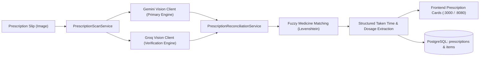

# MediLink 2.0: Smart Emergency Medicine & Health Assistant

[](https://www.oracle.com/java/)
[](https://spring.io/projects/spring-boot)
[](https://www.postgresql.org/)
[](https://maven.apache.org/)
[](https://spring.io/)
[](https://ai.google.dev/)
[](https://groq.com/)
[](https://tesseract.projectnaptha.com/)
[-red?style=for-the-badge)](https://github.com/)

> **Advanced Object-Oriented Programming (AOOP) Capstone Project — 12th Semester**  
> An enterprise-grade, resilient healthcare management and emergency assistant platform tailored for the prescription, pharmacy inventory, and counterfeit medicine verification ecosystem in Bangladesh.

---

## 📑 Table of Contents
- [🌟 Executive Summary](#-executive-summary)
- [✨ Core Capabilities & Feature Modules](#-core-capabilities--feature-modules)
- [🤖 Dual-Engine AI Vision Prescription Scanner](#-dual-engine-ai-vision-prescription-scanner)
- [📈 Bangladesh Medicine Market Price Synchronization](#-bangladesh-medicine-market-price-synchronization)
- [📐 Advanced OOP Architecture & GoF Design Patterns](#-advanced-oop-architecture--gof-design-patterns)
  - [1. Factory Pattern](#1-factory-pattern)
  - [2. Observer Pattern & SSE Streaming](#2-observer-pattern--sse-streaming)
  - [3. Strategy Pattern](#3-strategy-pattern)
  - [4. State Pattern](#4-state-pattern)
  - [5. Decorator Pattern](#5-decorator-pattern)
  - [6. Polymorphic JPA Inheritance (JOINED)](#6-polymorphic-jpa-inheritance-joined)
  - [7. Singleton Pattern & Spring IoC Scoping](#7-singleton-pattern--spring-ioc-scoping)
  - [8. Multithreading & Scheduled Daemon Processing](#8-multithreading--scheduled-daemon-processing)
- [🏗️ System Architecture & Data Flow](#️-system-architecture--data-flow)
- [🔌 Complete REST API Reference (13 Controllers)](#-complete-rest-api-reference-13-controllers)
- [🗄️ Database Schema & Auto-Seeding](#️-database-schema--auto-seeding)
- [🚀 Prerequisites & Getting Started](#-prerequisites--getting-started)
  - [Environment Variables & .env Configuration](#environment-variables---env-configuration)
  - [Running the Application](#running-the-application)
- [👥 Demo User Credentials](#-demo-user-credentials)
- [📂 Project Directory Structure](#-project-directory-structure)
- [🧪 Verification & Testing (23 Automated Tests)](#-verification--testing-23-automated-tests)
- [📜 Academic Attribution & License](#-academic-attribution--license)

---

## 🌟 Executive Summary

**MediLink 2.0** solves critical challenges in the pharmaceutical supply and patient healthcare ecosystem of Bangladesh:
1. **Medicine Affordability & Transparency**: Patients struggle to identify generic alternatives and face arbitrary price variations across retail pharmacies. MediLink 2.0 includes automated Bangladesh market price synchronization with DGDA and Medex reference benchmarks.
2. **Counterfeit Drug Epidemic**: The proliferation of counterfeit or unverified medicines puts lives at risk. MediLink 2.0 integrates official **Directorate General of Drug Administration (DGDA)** batch verification.
3. **Drug Safety & Drug-Drug Interactions**: Patients taking multiple prescription medications are vulnerable to dangerous adverse interactions, paracetamol hepatotoxicity, and CYP-enzyme contraindications.
4. **Prescription Inefficiencies & Illegibility**: Illegible physical handwriting causes fatal dispensing errors. MediLink provides **Dual-AI Vision Multimodal Scanning (Google Gemini + Groq)** with cross-model reconciliation, clinical taken time detection, attached **voice memos**, and state-managed pharmacist verification.
5. **Emergency Response**: Instant identification of 24/7 pharmacies in Dhaka using geospatial math (Haversine formula), real-time stock broadcasts via Server-Sent Events (SSE), and direct emergency hotline dispatch.

---

## ✨ Core Capabilities & Feature Modules

| Module | Features & Capabilities | Underlying Technology |
| :--- | :--- | :--- |
| **Dual-AI Vision Prescription Scanner** | Multimodal AI vision transcription combining **Google Gemini** and **Groq Llama 3.2 Vision**. Transcribes doctor handwriting, patient name, doctor degree/reg, hospital, potencies, dosages, meal relations, and clinical taken times. | Dual AI Multimodal Vision, Spring `MultipartFile`, JSON Schema |
| **Multi-Engine Reconciliation** | Independent cross-verification between Gemini and Groq, Levenshtein fuzzy medicine matching, agreement scoring, and intelligent fallback to eliminate unverified or conflicting data. | `PrescriptionReconciliationService`, DTOs |
| **Medicine Taken Time Chips** | Scanned medicine cards present dedicated visual badges: **🌅 Morning**, **☀️ Afternoon**, **🌙 Night**, **⚡ Immediately (Stat)**, **🍽️ Before/After meal**, and **⏳ Duration** with zero confusing placeholders. | Responsive CSS Badges, Clinical Note Parsers |
| **Multi-Role Portal** | Distinct dashboard layouts, permissions, and metric summaries for **Patients**, **Pharmacists**, and **Administrators**. | Factory Pattern, Polymorphic JPA |
| **Admin Dashboard & Telemetry** | Centralized platform governance: live JVM memory telemetry (heap MB, CPU cores, uptime), full User CRUD, Medicine Catalog management, and global emergency broadcast. | Spring Boot Actuator metrics, JPA, SSE |
| **Partner Pharmacy Network** | Complete administrative lifecycle management (Registration, Area Coverage, 24/7 Hours, Emergency Dispatch, Stock cascade cleanup). | Spring Data JPA, Cascade Operations |
| **BD Market Price Synchronization** | Scheduled background auto-sync of retail medicine prices against Bangladesh DGDA and Medex indices, price history audit logs, and external webhook ingestion. | `@Scheduled`, Observer Pattern, Webhook REST API |
| **Smart Medicine Finder** | Search brand names, generic formulations, and identify therapeutic alternatives across major Bangladeshi pharmaceuticals (Beximco, Square, Incepta, Renata, Acme). | Strategy Pattern (`MedicineSearchStrategy`) |
| **Cross-Pharmacy Price Comparison** | Compares retail prices across verified Dhaka pharmacies (Lazz Pharma, Tamanna, Green Pharma, etc.) and highlights best savings. | Strategy Pattern (`PriceSearchStrategy`) |
| **Drug-Drug Interaction Engine** | Evaluates contraindications, synergistic toxicity, and duplicate therapies in both **Standard Warning** and **Clinical Strict** modes. | Strategy Pattern (`InteractionCheckStrategy`) |
| **Prescription Lifecycle Workflow** | Multi-phase prescription progression: `UPLOADED` $\rightarrow$ `EXTRACTED` $\rightarrow$ `VERIFIED` $\rightarrow$ `DISPENSE_READY` with pharmacist sign-off and administrative compliance auditing. | State Pattern (`PrescriptionState`), JPA `@PostLoad` |
| **Anti-Counterfeit Medicine Verifier** | DGDA batch code verification, QR/barcode scanning simulation, manufacturer validation, and counterfeit alert generation. | Verification Strategy & Repository Lookup |
| **Live Pharmacy Inventory** | Pharmacists adjust stock in real-time; changes trigger instant reactive pushes to connected clients without browser refresh. | Observer Pattern, Spring `SseEmitter` |
| **24/7 Emergency Pharmacy Locator** | Real-time Haversine distance calculations from patient coordinates to open pharmacies across Dhaka, with direct emergency call links. | Haversine Formula, Geolocation API |
| **Medication Reminders & Pill Tracker** | Interactive dosage adherence: "Take Dose", 15m snooze, 1-click prescription intake parsing (`⚡ Sync`), meal timing, audible chime alarms, and background daemon alerts. | Spring `@Scheduled`, Web Audio API |
| **24/7 Gemini AI Clinical Assistant** | Context-aware AI chatbot powered by **Google Gemini Flash** with multi-lingual auto-detection (Bangla, English, Arabic, Spanish, French, Urdu) and offline **Local Clinical Fallback**. | Strategy Pattern (`AiChatStrategy`), Gemini REST API |
| **Pharmacist Live Chat** | Real-time consultation chat between patients and licensed pharmacists, with full message history persisted in PostgreSQL. | JPA Persistence, REST API |
| **Data Portability & Reports** | Instant client-side CSV exports for User Directories, Medicine Inventories, and Partner Pharmacy networks. | Client-side Blob & CSV Generator |
| **Modern Glassmorphic UI/UX** | Responsive layouts, dual-panel sliding authentication modal, international dial-code selector, password meter, and high-contrast Dark/Light modes. | Vanilla CSS Variables, Vanilla JS SPA |

---

## 🤖 Dual-Engine AI Vision Prescription Scanner

MediLink 2.0 incorporates a resilient **Dual-Engine Multimodal Vision Pipeline** designed for high clinical safety:


```mermaid
flowchart LR
    IMAGE["Prescription Slip (Image)"] --> SCANNER["PrescriptionScanService"]
    SCANNER --> GEMINI["Gemini Vision Client (Primary Engine)"]
    SCANNER --> GROQ["Groq Vision Client (Verification Engine)"]
    GEMINI --> RECON["PrescriptionReconciliationService"]
    GROQ --> RECON
    RECON --> LEV["Fuzzy Medicine Matching (Levenshtein)"]
    LEV --> CHIPS["Structured Taken Time & Dosage Extraction"]
    CHIPS --> CLIENT["Frontend Prescription Cards (:3000 / :8080)"]
    CHIPS --> DB[("PostgreSQL: prescriptions & items")]
```

### Key Technical Characteristics:
1. **Primary Multimodal Vision (`GeminiPrescriptionClient.java`)**:
   - Transcribes handwritten notes, unlabelled doctor instructions, and dosage schedules.
   - Configurable model (default `gemini-3.6-flash` or `gemini-1.5-flash`).
2. **Independent Cross-Verification (`GroqPrescriptionClient.java`)**:
   - Concurrently processes prescription slip or extracted handwriting text via ultra-fast Groq Llama 3.2 Vision / language models.
3. **Reconciliation & Safety Rules (`PrescriptionReconciliationService.java`)**:
   - Reconciles patient demographics cleanly, stripping noisy parenthetical annotations (`Vivek S. (19/M)` $\rightarrow$ `Vivek S.`).
   - Pairs medicines across models using Levenshtein distance matching.
   - Cleanses missing or conflicting data: intelligently derives times of day (Morning, Afternoon, Night, Stat) from directions without cluttering user screens with ambiguous placeholder options.
4. **Dynamic Configuration & Hot-Reload (`AiVisionConfig.java`)**:
   - Reads directly from `.env` or Spring `application.properties`.
   - Allows instant runtime key updates without restarting JVM processes.

---

## 📈 Bangladesh Medicine Market Price Synchronization

MediLink 2.0 features an automated, enterprise-grade medicine market price tracking and synchronization subsystem designed to keep retail pharmaceutical pricing aligned with real-world Bangladesh market rates:

- **Service**: [`MarketPriceSyncService.java`](file:///d:/ACADEMIC%20CAREER/12th%20Semester/Advance%20OOP/Medilink2.0/src/main/java/com/medilink/service/market/MarketPriceSyncService.java)
- **Controller**: [`MarketPriceController.java`](file:///d:/ACADEMIC%20CAREER/12th%20Semester/Advance%20OOP/Medilink2.0/src/main/java/com/medilink/controller/MarketPriceController.java)
- **Matching Engine**: [`MedicinePriceMatchingService.java`](file:///d:/ACADEMIC%20CAREER/12th%20Semester/Advance%20OOP/Medilink2.0/src/main/java/com/medilink/service/market/MedicinePriceMatchingService.java)
- **Composite Strategy**: [`CompositeMarketPriceProvider.java`](file:///d:/ACADEMIC%20CAREER/12th%20Semester/Advance%20OOP/Medilink2.0/src/main/java/com/medilink/service/market/CompositeMarketPriceProvider.java)
- **External Client**: [`ExternalMedicineApiClient.java`](file:///d:/ACADEMIC%20CAREER/12th%20Semester/Advance%20OOP/Medilink2.0/src/main/java/com/medilink/service/market/client/ExternalMedicineApiClient.java)
- **Fallback Provider**: [`BangladeshDgdaMedexProvider.java`](file:///d:/ACADEMIC%20CAREER/12th%20Semester/Advance%20OOP/Medilink2.0/src/main/java/com/medilink/service/market/BangladeshDgdaMedexProvider.java)

---

### A. Provider Identity & Nature

- **Active External Provider**: **MedEx via Apify** using Actor [`riad_h~medex-medicine-scraper`](https://apify.com/riad_h/medex-medicine-scraper).
- **Important Distinction**: This external integration communicates with a **community scraper** that indexes retail pricing from the public Bangladesh MedEx catalog. It is **NOT an official government DGDA (Directorate General of Drug Administration) API**.
- Official regulatory batch verification remains handled separately by MediLink's `DgdaBatchVerificationStrategy`.

---

### B. Scraper Characteristics & Field Availability

Because the Apify Actor is a community scraper:
- Scrape duration, network latency, and availability can fluctuate.
- Guaranteed scraped fields include: `brand_name`, `strength`, `dosage_form`, `brand_id`, `url`, and `unit_price` / `mrp`.
- Scraped records **may lack** `generic_name` and `manufacturer`. MediLink 2.0 is hardened to gracefully accept quotes missing these fields without failing validation.
- Safe 5-Tier matching ensures prices are only applied to local medicines when unambiguous brand identity is verified.

---

### C. Exact Environment Configuration

Create a `.env` file in the project root (never committed to version control):

```bash
# Market Integration Activation
MARKET_API_ENABLED=true
MARKET_PROVIDER=external

# Apify Gateway & Actor
MARKET_API_BASE_URL=https://api.apify.com/v2
MARKET_API_KEY=YOUR_ACTUAL_APIFY_TOKEN
MARKET_API_KEY_HEADER=Authorization
MARKET_API_KEY_PREFIX=Bearer
MEDICINE_APIFY_ACTOR_ID=riad_h~medex-medicine-scraper

# Resilience, Timeouts & Retries
MARKET_CONNECT_TIMEOUT_MS=10000
MARKET_READ_TIMEOUT_MS=120000
MARKET_MAX_RETRIES=2
MARKET_FALLBACK_ENABLED=true

# Scheduler (Runs every 5 minutes)
MARKET_SYNC_DELAY_MS=300000
MARKET_INITIAL_DELAY_MS=15000

# Safety & Anti-Tamper Controls
MARKET_WEBHOOK_SECRET=
MARKET_SIMULATION_ENABLED=false
MARKET_MAX_PRICE_CHANGE_PERCENT=50.0

# MedEx Actor Scraping Limits
MARKET_SEARCH_DEPTH=1
MARKET_MAX_RESULTS=100
MARKET_REQUEST_DELAY_MS=200
```

---

### D. Manual Live Synchronization Procedure

To trigger a live external synchronization on demand:

```bash
curl -X POST http://localhost:8080/api/market/sync \
  -H "Content-Type: application/json" \
  -d '{"triggerSource": "Manual Admin Live Test"}'
```

**Response includes full sync metrics**:
```json
{
  "status": "COMPLETED",
  "message": "Market price synchronization completed successfully.",
  "triggerSource": "Manual Admin Live Test",
  "provider": "MedEx via Apify",
  "checkedMedicines": 12,
  "updatedMedicines": 2,
  "statistics": {
    "localMedicinesConsidered": 12,
    "externalRecordsRetrieved": 100,
    "matchedMedicines": 10,
    "updatedMedicines": 2,
    "unchangedMedicines": 8,
    "unmatchedMedicines": 2,
    "invalidPriceRecords": 0,
    "failedExternalRequests": 0,
    "syncCoveragePercent": "83.3%",
    "status": "PARTIAL_SUCCESS",
    "timestamp": "2026-09-26T10:45:00"
  }
}
```

---

### E. Diagnostic & Status Reporting

Check health, provider status, and connectivity at `GET /api/market/status`:

```bash
curl -X GET http://localhost:8080/api/market/status
```

**Distinguishing Configuration vs Reachability vs Sync**:
- `externalApiConfigured: true`: Credentials and URL are populated in configuration.
- `externalApiReachable: true`: A real HTTP network exchange with the Apify Actor completed successfully (HTTP 200).
- `data successfully synchronized`: External records were fetched, parsed, safely matched against PostgreSQL medicines, and persisted.

```json
{
  "status": "SUCCESS",
  "enabled": true,
  "provider": "external",
  "providerName": "MedEx via Apify",
  "providerMode": "LIVE_EXTERNAL_API",
  "externalApiConfigured": true,
  "externalApiReachable": true,
  "fallbackEnabled": true,
  "fallbackActive": false,
  "lastSyncStatus": "PARTIAL_SUCCESS",
  "lastSyncAt": "2026-09-26T10:45:00",
  "lastSyncStatistics": {
    "localMedicinesConsidered": 12,
    "externalRecordsRetrieved": 100,
    "matchedMedicines": 10,
    "updatedMedicines": 2,
    "unchangedMedicines": 8,
    "unmatchedMedicines": 2,
    "syncCoveragePercent": "83.3%",
    "status": "PARTIAL_SUCCESS"
  }
}
```

---

### F. Verifying PostgreSQL Updates & Price History

1. **Verify updated catalog prices**:
   ```sql
   SELECT id, brand_name, generic_name, company, unit_price 
   FROM medicines 
   ORDER BY brand_name;
   ```
   *`unit_price` updates only when a valid, positive, non-excessive external price is matched.*

2. **Verify pharmacy stock cascade**:
   ```sql
   SELECT p.name AS pharmacy_name, m.brand_name, s.unit_price, s.last_updated 
   FROM pharmacy_stocks s
   JOIN medicines m ON s.medicine_id = m.id
   JOIN partner_pharmacies p ON s.pharmacy_id = p.id;
   ```

3. **Verify audit trail in Price History**:
   ```sql
   SELECT id, brand_name, old_price, new_price, price_change, percentage_change, direction, source_registry, timestamp 
   FROM medicine_price_history 
   ORDER BY timestamp DESC 
   LIMIT 10;
   ```

---

### G. Resilient Fallback & Timeout Behavior

- **HTTP Read Timeout**: Increased to **120,000 ms (2 minutes)** to accommodate comprehensive headless scraping runs on Apify.
- **Graceful Timeout Recovery**: If Apify times out or is unreachable, the system:
  - Logs a structured warning.
  - Leaves all existing PostgreSQL prices and pharmacy stocks completely untouched.
  - Automatically activates the local benchmark registry (`BangladeshDgdaMedexProvider`) if `MARKET_FALLBACK_ENABLED=true`.
  - Sets diagnostic status to `TIMED_OUT` or `DEGRADED`.
  - Never crashes background scheduler threads; subsequent sync cycles continue normally.

---

### H. The ">100 Medicines" Strategy & Scraper Limitations

- **Actor Boundary**: The Apify Actor `riad_h~medex-medicine-scraper` does not support arbitrary search query parameters in its input schema (only `searchDepth`, `maxResults`, `requestDelayMs`).
- **PostgreSQL-Grounded Sync**: Synchronization iterates through the medicines that **actually exist in PostgreSQL** (`medicineRepository.findAll()`).
- **Partial Coverage Reporting**: If PostgreSQL contains more medicines than the scraped batch (e.g. catalog has 150 medicines while the scraper yields 100):
  - MediLink never falsely claims 100% synchronization.
  - Calculates true `syncCoveragePercent` (e.g. `66.7%`).
  - Reports status `PARTIAL_SUCCESS`.
  - Preserves local prices for all unmatched medicines.
  - Deduplicates multiple external quotes targeting the same medicine to prevent duplicate audits.

---

---

## 📐 Advanced OOP Architecture & GoF Design Patterns

MediLink 2.0 was developed for the **Advanced Object-Oriented Programming (AOOP)** course, demonstrating rigorous adherence to SOLID principles, design patterns, and clean code architecture.

```
com.medilink
├── config/        # Spring MVC, CORS, AiVisionConfig, and DataSeeder initializers
├── controller/    # 13 REST API Controllers (Root, Auth, Admin, Meds, Scan, Market, etc.)
├── dto/           # Data Transfer Objects for AI scan results & extracted items
├── model/         # Core Domain Models, Entities, and OOP Patterns
│   ├── chat/      # Consultation chat models
│   ├── market/    # Market price quotes & price fluctuation history
│   ├── medicine/  # Medicine domain & Decorator pattern classes
│   ├── observer/  # Observer pattern Subject and Notifiable interfaces
│   ├── pharmacy/  # Pharmacy and stock models
│   ├── prescription/ # Prescription entity and State pattern hierarchy
│   ├── reminder/  # Medication reminder models
│   ├── strategy/  # Search, Interaction, Verification, and AI Strategies
│   └── user/      # User hierarchy, UserFactory, Role enums
├── repository/    # 12 Spring Data JPA interfaces
└── service/       # Business logic services, AI clients, singletons, and market sync
```

---

### 1. Factory Pattern
- **Interface & Classes**: [`UserFactory.java`](file:///d:/ACADEMIC%20CAREER/12th%20Semester/Advance%20OOP/Medilink2.0/src/main/java/com/medilink/model/user/UserFactory.java) $\rightarrow$ [`Patient.java`](file:///d:/ACADEMIC%20CAREER/12th%20Semester/Advance%20OOP/Medilink2.0/src/main/java/com/medilink/model/user/Patient.java), [`Pharmacist.java`](file:///d:/ACADEMIC%20CAREER/12th%20Semester/Advance%20OOP/Medilink2.0/src/main/java/com/medilink/model/user/Pharmacist.java), [`Admin.java`](file:///d:/ACADEMIC%20CAREER/12th%20Semester/Advance%20OOP/Medilink2.0/src/main/java/com/medilink/model/user/Admin.java)
- **Role**: Decouples user object instantiation from authentication and registration controllers.

---

### 2. Observer Pattern & SSE Streaming
- **Interfaces & Classes**: [`Subject.java`](file:///d:/ACADEMIC%20CAREER/12th%20Semester/Advance%20OOP/Medilink2.0/src/main/java/com/medilink/model/observer/Subject.java), [`Notifiable.java`](file:///d:/ACADEMIC%20CAREER/12th%20Semester/Advance%20OOP/Medilink2.0/src/main/java/com/medilink/model/observer/Notifiable.java), [`PharmacyStock.java`](file:///d:/ACADEMIC%20CAREER/12th%20Semester/Advance%20OOP/Medilink2.0/src/main/java/com/medilink/model/pharmacy/PharmacyStock.java), [`StockObserverService.java`](file:///d:/ACADEMIC%20CAREER/12th%20Semester/Advance%20OOP/Medilink2.0/src/main/java/com/medilink/service/StockObserverService.java), [`EventStreamController.java`](file:///d:/ACADEMIC%20CAREER/12th%20Semester/Advance%20OOP/Medilink2.0/src/main/java/com/medilink/controller/EventStreamController.java)
- **Role**: Implements loose coupling for real-time inventory updates and market price notifications.
- **Workflow**:
  1. `PharmacyStock` implements `Subject` and maintains a list of `Notifiable` observers.
  2. When quantity changes via `/api/pharmacies/stocks` or market price changes via `/api/market/sync`, `notifyObservers()` fires.
  3. `StockObserverService` broadcasts the event to connected HTTP clients via Spring `SseEmitter` at `/api/events/stream`.

---

### 3. Strategy Pattern
The Strategy pattern is utilized across multiple domains for runtime algorithmic interchangeability:
- **Medicine Search**: `BrandSearchStrategy`, `GenericSearchStrategy`, `PriceSearchStrategy`.
- **Drug Interactions**: `StandardWarningStrategy`, `ClinicalStrictStrategy`.
- **AI Consultation**: `GeminiAiStrategy`, `LocalClinicalFallbackStrategy`.
- **Batch Verification**: `DgdaBatchVerificationStrategy`, `BarcodeVerificationStrategy`.
- **Market Price Provider**: `MarketPriceProvider`, `BangladeshDgdaMedexProvider`.

---

### 4. State Pattern
- **Interface & Classes**: [`PrescriptionState.java`](file:///d:/ACADEMIC%20CAREER/12th%20Semester/Advance%20OOP/Medilink2.0/src/main/java/com/medilink/model/prescription/PrescriptionState.java), [`UploadedState.java`](file:///d:/ACADEMIC%20CAREER/12th%20Semester/Advance%20OOP/Medilink2.0/src/main/java/com/medilink/model/prescription/UploadedState.java), [`ExtractedState.java`](file:///d:/ACADEMIC%20CAREER/12th%20Semester/Advance%20OOP/Medilink2.0/src/main/java/com/medilink/model/prescription/ExtractedState.java), [`VerifiedState.java`](file:///d:/ACADEMIC%20CAREER/12th%20Semester/Advance%20OOP/Medilink2.0/src/main/java/com/medilink/model/prescription/VerifiedState.java), [`DispenseReadyState.java`](file:///d:/ACADEMIC%20CAREER/12th%20Semester/Advance%20OOP/Medilink2.0/src/main/java/com/medilink/model/prescription/DispenseReadyState.java)
- **Entity**: [`Prescription.java`](file:///d:/ACADEMIC%20CAREER/12th%20Semester/Advance%20OOP/Medilink2.0/src/main/java/com/medilink/model/prescription/Prescription.java)
- **Lifecycle**: `UPLOADED` $\rightarrow$ `EXTRACTED` $\rightarrow$ `VERIFIED` $\rightarrow$ `DISPENSE_READY`.

---

### 5. Decorator Pattern
- **Abstract Decorator**: [`MedicineBadgeDecorator.java`](file:///d:/ACADEMIC%20CAREER/12th%20Semester/Advance%20OOP/Medilink2.0/src/main/java/com/medilink/model/medicine/MedicineBadgeDecorator.java) (extends `Medicine`)
- **Concrete Decorators**:
  - `VerifiedBadgeDecorator`: Appends `[✓ DGDA VERIFIED GENUINE]` regulatory badge.
  - `LowStockBadgeDecorator`: Appends `[⚠️ LOW INVENTORY ALERT]` warning flag.

---

### 6. Polymorphic JPA Inheritance (JOINED)
- **Base Entity**: [`User.java`](file:///d:/ACADEMIC%20CAREER/12th%20Semester/Advance%20OOP/Medilink2.0/src/main/java/com/medilink/model/user/User.java) with `@Inheritance(strategy = InheritanceType.JOINED)`.
- **Subclasses**: `Patient`, `Pharmacist`, `Admin`.
- Preserves 3NF relational integrity in PostgreSQL (`users`, `patients`, `pharmacists`, `admins`).

---

### 7. Singleton Pattern & Spring IoC Scoping
- Core services (`StockObserverService`, `AiChatService`, `VerificationService`) provide a thread-safe static `getInstance()` method while integrating cleanly with Spring's `@Service` singleton application context.

---

### 8. Multithreading & Scheduled Daemon Processing
- **Reminder Daemon**: [`ReminderService.java`](file:///d:/ACADEMIC%20CAREER/12th%20Semester/Advance%20OOP/Medilink2.0/src/main/java/com/medilink/service/ReminderService.java) executes every 60 seconds (`@Scheduled`) to check active dosage alerts.
- **Market Price Daemon**: [`MarketPriceSyncService.java`](file:///d:/ACADEMIC%20CAREER/12th%20Semester/Advance%20OOP/Medilink2.0/src/main/java/com/medilink/service/market/MarketPriceSyncService.java) executes every 5 minutes to verify retail price ceilings across Bangladesh.

---

## 🏗️ System Architecture & Data Flow

```mermaid
flowchart TD
    subgraph Client["Frontend Client (Single Page App :3000 / :8080)"]
        UI["Vanilla JS SPA (app.js v5.2)"]
        OCR_CLIENT["Tesseract.js OCR Engine (Offline Fallback)"]
        AUDIO["Web Audio API / MediaRecorder (Voice Memos)"]
        THEME["Theme Engine (Light/Dark Switcher)"]
    end

    subgraph SpringBoot["MediLink 2.0 Spring Boot Backend (:8080)"]
        subgraph Controllers["13 REST Controllers"]
            C_AUTH["AuthController"]
            C_MED["MedicineController"]
            C_MKT["MarketPriceController"]
            C_RX["PrescriptionController"]
            C_PHARM["PharmacyController"]
            C_REM["ReminderController"]
            C_CHAT["ChatController"]
            C_AI["AiController"]
            C_SSE["EventStreamController"]
            C_STAT["StatsController"]
            C_PAT["PatientController"]
            C_ADMIN["AdminController"]
            C_ROOT["RootController"]
        end

        subgraph ServiceLayer["Business & Pattern Services"]
            S_USER["UserService + UserFactory"]
            S_MED["MedicineService"]
            S_MKT["MarketPriceSyncService (@Scheduled)"]
            S_SCAN["PrescriptionScanService (Dual AI Vision)"]
            S_RX["PrescriptionService + State Pattern"]
            S_OBS["StockObserverService (Subject)"]
            S_AI["AiChatService + Strategy Pattern"]
            S_VERIF["VerificationService"]
            S_REM["ReminderService (@Scheduled)"]
        end

        subgraph JPA["Spring Data JPA Repositories (12 Repositories)"]
            R_USER["UserRepository"]
            R_MED["MedicineRepository"]
            R_PHARM["PharmacyRepository"]
            R_STOCK["PharmacyStockRepository"]
            R_RX["PrescriptionRepository"]
            R_REM["ReminderRepository"]
            R_CHAT["ChatMessageRepository"]
            R_HIST["PriceHistoryRepository"]
        end
    end

    subgraph ExternalServices["External Cloud & AI Services"]
        GEMINI["Google Gemini API (gemini-3.6-flash)"]
        GROQ["Groq Vision API (llama-3.2-11b-vision)"]
        SSE_STREAM["Server-Sent Events Broadcast"]
    end

    subgraph Database["PostgreSQL (medilink_db)"]
        T_USERS["users / patients / pharmacists / admins"]
        T_MEDS["medicines & price_history"]
        T_PHARMS["pharmacies & pharmacy_stocks"]
        T_RX["prescriptions & prescription_items"]
        T_REM["reminders"]
        T_CHAT["chat_messages"]
    end

    UI -->|REST API HTTP/JSON| Controllers
    UI -->|Image Upload (MultipartFile)| C_RX
    C_RX --> S_SCAN
    S_SCAN --> GEMINI
    S_SCAN --> GROQ
    C_SSE -->|Real-Time Event Stream| SSE_STREAM --> UI

    Controllers --> ServiceLayer
    ServiceLayer --> JPA
    JPA --> Database

    S_OBS -->|Trigger Broadcast| C_SSE
    S_MKT -->|Trigger Price Update Alert| S_OBS
```

---

## 🔌 Complete REST API Reference (13 Controllers)

### 1. Authentication & User Profile (`/api/auth`, `/api/patient`)
| Method | Endpoint | Description | Request Body / Query |
| :--- | :--- | :--- | :--- |
| `POST` | `/api/auth/login` | Authenticate user (Patient, Pharmacist, Admin) | `{"email": "...", "password": "..."}` |
| `POST` | `/api/auth/register` | Register user via `UserFactory` | `{"name": "...", "email": "...", "password": "...", "role": "PATIENT", ...}` |
| `POST` | `/api/auth/send-otp` | Generate self-service password reset OTP | `{"email": "..."}` |
| `POST` | `/api/auth/verify-otp` | Validate user OTP & update credentials | `{"email": "...", "otp": "..."}` |
| `GET` | `/api/patient/profile` | Retrieve patient clinical profile | Query: `?id=...` or `?email=...` |
| `POST` | `/api/patient/profile` | Update medical profile & emergency contacts | `{"id": "...", "bloodType": "...", "allergies": "...", ...}` |

### 2. Medicines, Alternatives & Anti-Counterfeit Verification (`/api/medicines`)
| Method | Endpoint | Description | Request Body / Query |
| :--- | :--- | :--- | :--- |
| `GET` | `/api/medicines` | Retrieve catalog of all medicines | — |
| `GET` | `/api/medicines/search` | Search via Strategy (`brand`, `generic`, `price`) | Query: `?query=napa&strategy=brand` |
| `GET` | `/api/medicines/alternatives` | Find alternative brands with the same generic molecule | Query: `?generic=Paracetamol&excludeBrand=Napa` |
| `GET` | `/api/medicines/compare-prices`| Compare live pharmacy prices across Dhaka | Query: `?medicine=Napa+Extra` |
| `POST` | `/api/medicines/interaction-check` | Evaluate drug-drug interactions | `{"medicines": "Napa Extra, Ace Plus", "mode": "CLINICAL"}` |
| `POST` | `/api/medicines/verify` | Verify medicine authenticity against DGDA records | `{"medicineId": "med_01", "code": "BEX-2026-A1"}` |

### 3. Prescriptions & AI Multimodal Scanning (`/api/prescriptions`)
| Method | Endpoint | Description | Request Body / Query |
| :--- | :--- | :--- | :--- |
| `POST` | `/api/prescriptions/scan` | **Dual-Engine Multimodal Vision Scan** (Gemini + Groq) | `multipart/form-data`: `file`, `patientId`, `patientName` |
| `GET` | `/api/prescriptions` | Get all active prescriptions with items and taken times | — |
| `POST` | `/api/prescriptions/upload` | Save prescription with structured line items & voice note | `{"patientName": "...", "doctorName": "...", "items": [...], "voiceNoteAudio": "..."}` |
| `POST` | `/api/prescriptions/advance` | Advance workflow status (State Pattern transition) | `{"prescriptionId": "rx_01"}` |
| `POST` | `/api/prescriptions/delete` | Remove prescription record and notify observers | `{"prescriptionId": "rx_01"}` |

### 4. Bangladesh Market Price Synchronization (`/api/market`)
| Method | Endpoint | Description | Request Body / Query |
| :--- | :--- | :--- | :--- |
| `GET` | `/api/market/prices` | Retrieve live Bangladesh market price index & provider status | — |
| `POST` | `/api/market/sync` | Trigger an immediate manual/admin market price synchronization | Query / Body: `?source=Manual+Trigger` |
| `GET` | `/api/market/history` | Retrieve historical price fluctuation audit records | — |
| `POST` | `/api/market/webhook` | External distributor / DGDA push webhook receiver | `{"brandName": "Napa Extra", "newPrice": 3.20}` |

### 5. Pharmacy, Stock & Real-Time Observer Events (`/api/pharmacies`, `/api/events`)
| Method | Endpoint | Description | Request Body / Query |
| :--- | :--- | :--- | :--- |
| `GET` | `/api/pharmacies` | List all verified partner pharmacies | — |
| `GET` | `/api/pharmacies/emergency` | Find 24/7 pharmacies sorted by Haversine distance | Query: `?lat=23.7465&lng=90.3760` |
| `GET` | `/api/pharmacies/stocks` | Retrieve inventory levels across all stores | — |
| `POST` | `/api/pharmacies/stocks` | Update stock quantity and broadcast to observers | `{"stockId": "stk_01", "quantity": 45}` |
| `GET` | `/api/events/stream` | Real-time Server-Sent Events (SSE) stream | Produces: `text/event-stream` |

### 6. Medication Reminders & Dosage Scheduler (`/api/reminders`)
| Method | Endpoint | Description | Request Body / Query |
| :--- | :--- | :--- | :--- |
| `GET` | `/api/reminders` | Retrieve active patient medication reminders | — |
| `POST` | `/api/reminders/create` | Schedule appointment or dose reminder | `{"medicine": "Seclo 20", "dosage": "1 Cap", "time": "08:00", ...}` |
| `GET` | `/api/reminders/test-alert`| Trigger instant test alarm via SSE broadcast | — |

### 7. Pharmacist Live Chat & Gemini AI Assistant (`/api/chat`, `/api/ai`)
| Method | Endpoint | Description | Request Body / Query |
| :--- | :--- | :--- | :--- |
| `GET` | `/api/chat/messages` | Fetch consultation chat history | Query: `?user1=usr_patient_01&user2=usr_pharma_01` |
| `POST` | `/api/chat/send` | Send real-time consultation chat message | `{"senderId": "...", "receiverId": "...", "content": "..."}` |
| `POST` | `/api/ai/chat` | Query AI Clinical Assistant (Gemini / Fallback) | `{"message": "...", "apiKey": "...", "patientId": "..."}` |
| `GET` | `/api/ai/status` | Check AI engine configuration and active strategy | — |

### 8. Platform Statistics (`/api/stats`)
| Method | Endpoint | Description |
| :--- | :--- | :--- |
| `GET` | `/api/stats` | Returns real-time platform statistics (active users, pharmacies, prescriptions, reminders) |

### 9. System Administration, Governance & Telemetry (`/api/admin`)
| Method | Endpoint | Description | Request Body / Query |
| :--- | :--- | :--- | :--- |
| `GET` | `/api/admin/telemetry` | Real-time JVM memory (heap MB), CPU cores, server uptime, DB status, and audit log | — |
| `GET` | `/api/admin/users` | Retrieve complete user directory across all polymorphic roles | — |
| `POST` | `/api/admin/users` | Provision new user (`PATIENT`, `PHARMACIST`, `ADMIN`) | `{"name": "...", "email": "...", "password": "...", "role": "PHARMACIST", ...}` |
| `PUT` | `/api/admin/users/{id}` | Update existing user credentials, contact, and role attributes | `{"name": "...", "email": "...", "phone": "..."}` |
| `DELETE` | `/api/admin/users/{id}` | Deactivate or remove user from database | — |
| `GET` | `/api/admin/medicines` | Retrieve full medicine master catalog | — |
| `POST` | `/api/admin/medicines` | Add new medicine with pricing, strength, formulation, and DGDA batch codes | `{"brandName": "...", "genericName": "...", "unitPrice": 12.5, ...}` |
| `PUT` | `/api/admin/medicines/{id}` | Modify medicine specifications or retail price ceiling | `{"unitPrice": 14.0, ...}` |
| `DELETE` | `/api/admin/medicines/{id}` | Delete medicine from platform inventory | — |
| `GET` | `/api/admin/pharmacies` | List partner pharmacies with live inventory stock counts | — |
| `POST` | `/api/admin/pharmacies` | Register new partner pharmacy with coordinates, 24/7 hours, and emergency delivery | `{"name": "...", "area": "...", "is24Hours": true, "latitude": 23.75, ...}` |
| `PUT` | `/api/admin/pharmacies/{id}` | Update partner pharmacy details, phone, or service flags | `{"phone": "...", "hasEmergencyDelivery": true}` |
| `DELETE` | `/api/admin/pharmacies/{id}` | Remove partner pharmacy and cascade cleanup of linked stock | — |
| `POST` | `/api/admin/broadcast` | Broadcast emergency system announcement to all active SSE client streams | `{"message": "Scheduled server maintenance at 02:00 UTC."}` |

---

## 🗄️ Database Schema & Auto-Seeding

MediLink 2.0 uses **PostgreSQL**. Tables are defined in [`medilink_schema.sql`](file:///d:/ACADEMIC%20CAREER/12th%20Semester/Advance%20OOP/Medilink2.0/database/medilink_schema.sql) and auto-seeded by [`DataSeeder.java`](file:///d:/ACADEMIC%20CAREER/12th%20Semester/Advance%20OOP/Medilink2.0/src/main/java/com/medilink/config/DataSeeder.java) on application boot if empty.

### Relational Schema Summary
- **`users`**: Base table for joined inheritance (`id`, `name`, `email`, `password`, `phone`, `role`, `custom_avatar`, `created_at`).
- **`patients`**: Child table (`user_id` FK, `date_of_birth`, `gender`, `blood_type`, `allergies`, `chronic_conditions`, `emergency_contact`, `emergency_contacts_json`).
- **`pharmacists`**: Child table (`user_id` FK, `pharmacy_name`, `license_number`).
- **`admins`**: Child table (`user_id` FK, `department`).
- **`medicines`**: Comprehensive medicine catalog (`id`, `brand_name`, `generic_name`, `company`, `strength`, `formulation`, `unit_price`, `prescription_required`, `category`, `side_effects`, `valid_batch_codes`).
- **`pharmacies`**: Partner pharmacies (`id`, `name`, `address`, `area`, `phone`, `is_24_hours`, `latitude`, `longitude`).
- **`pharmacy_stocks`**: Inventory junction (`id`, `pharmacy_id`, `medicine_id`, `quantity`, `unit_price`, `last_updated`).
- **`prescriptions`**: Master prescription record (`id`, `patient_id`, `doctor_name`, `hospital_or_clinic`, `raw_scan_text`, `status`, `voice_note_audio`, `dispense_ready`, `created_at`).
- **`prescription_items`**: Extracted line items (`id`, `prescription_id` FK, `medicine_id`, `medicine_name`, `dosage`, `frequency`, `duration`, `instructions`).
- **`reminders`**: Patient schedules (`id`, `patient_id`, `medicine_name`, `dosage`, `reminder_time`, `frequency`, `instructions`, `active`).
- **`chat_messages`**: Consultation logs (`id`, `sender_id`, `sender_name`, `sender_role`, `receiver_id`, `content`, `timestamp`).
- **`medicine_price_history`**: Audit logs of market price shifts (`id`, `medicine_id`, `brand_name`, `old_price`, `new_price`, `source`, `timestamp`).

---

## 🚀 Prerequisites & Getting Started

### Prerequisites
1. **Java Development Kit (JDK)**: JDK 8, 11, 17, or 21 installed.
2. **PostgreSQL**: Running locally on port `5433` (or `5432`) with a database named `medilink_db`.
3. **Apache Maven**: Version 3.8+ (automatically resolved if using the bundled scripts).
4. **Node.js**: Version 14+ (optional, required only if using the standalone frontend server on `:3000`).

---

### Environment Variables & .env Configuration

Create a `.env` file at the project root (see [`.env.example`](file:///d:/ACADEMIC%20CAREER/12th%20Semester/Advance%20OOP/Medilink2.0/.env.example)):

```bash
# Database Configuration
DB_URL=jdbc:postgresql://localhost:5433/medilink_db
DB_PORT=5433
DB_USERNAME=postgres
DB_PASSWORD=Jubaier2@
SERVER_PORT=8080

# Dual-AI Vision Prescription Scanning (Gemini + Groq)
GEMINI_API_KEY=AIzaSy...YourGeminiKey
GEMINI_MODEL=gemini-3.6-flash

GROQ_API_KEY=gsk_...YourGroqKey
GROQ_MODEL=llama-3.2-11b-vision-preview
```

| Variable | Default Value | Description |
| :--- | :--- | :--- |
| `DB_URL` | `jdbc:postgresql://localhost:5433/medilink_db` | PostgreSQL JDBC connection URL |
| `DB_PORT` | `5433` | Port where PostgreSQL is running |
| `DB_USERNAME` | `postgres` | Database username |
| `DB_PASSWORD` | `Jubaier2@` | Database user password |
| `SERVER_PORT` | `8080` | Application HTTP port |
| `GEMINI_API_KEY` | *(Configured in .env)* | Google Gemini Multimodal Vision API key |
| `GEMINI_MODEL` | `gemini-1.5-flash` / `gemini-3.6-flash` | Gemini model name for prescription scanning |
| `GROQ_API_KEY` | *(Configured in .env)* | Groq Vision API key for independent cross-verification |
| `GROQ_MODEL` | `llama-3.2-11b-vision-preview` | Groq model name for transcription verification |

---

### Running the Application

MediLink 2.0 can be executed using the consolidated orchestrator scripts or manually via separate terminals.

#### Method 1: Using Consolidated Launcher Scripts (Recommended)

##### Option A: PowerShell Orchestrator
```powershell
.\run.ps1
```
*Launches an interactive prompt to select:*
- `[1]` **Fullstack Application**: Starts the Backend in a separate window and Frontend in current terminal.
- `[2]` **Backend REST API Only** (`:8080`).
- `[3]` **Frontend Web Client Only** (`:3000`).

You can also bypass the menu by specifying the mode parameter:
```powershell
.\run.ps1 -Mode 1   # Fullstack (Backend :8080 + Frontend :3000)
.\run.ps1 -Mode 2   # Backend REST API Only (:8080)
.\run.ps1 -Mode 3   # Frontend Web Client Only (:3000)
```

##### Option B: Command Prompt / Batch Wrapper
```cmd
run.bat
```
*A lightweight Windows batch wrapper that forwards all commands to `run.ps1`.*

---

#### Method 2: Running Manually in Separate Terminals (Step-by-Step)

##### Step 1: Ensure PostgreSQL Database is Running
Make sure PostgreSQL is active on port `5433` (or `5432`) with the database `medilink_db` created.

##### Step 2: Terminal 1 — Start Spring Boot Backend REST API (`:8080`)
```powershell
$env:DB_PASSWORD = "Jubaier2@"
mvn spring-boot:run
```

##### Step 3: Terminal 2 — Start Standalone Frontend Dev Server (`:3000`)
```powershell
cd frontend
node server.js
```
*The dev server serves static files directly from `src/main/resources/static/` at `http://localhost:3000` and automatically reverse-proxies `/api/*` requests to `http://localhost:8080`.*

---

#### Method 3: Backend-Only Single-Origin Mode (`:8080`)
Because all web assets are bundled inside `src/main/resources/static/`, Spring Boot serves the frontend SPA directly alongside the REST API:
```powershell
$env:DB_PASSWORD = "Jubaier2@"
mvn spring-boot:run
```
Then navigate directly to **[http://localhost:8080](http://localhost:8080)** in any web browser.

---

## 👥 Demo User Credentials

Pre-seeded accounts are available for testing role-specific features:

| Role | Name | Email Address | Password | Key Test Capabilities |
| :--- | :--- | :--- | :--- | :--- |
| **Patient** | Rahim Ahmed | `rahim@medilink.com` | `patient123` | Dual-AI prescription scanning, price comparison, drug interaction checks, dosage reminders, AI consultation, emergency mode. |
| **Pharmacist** | Dr. Farhan Kabir | `farhan@lazzpharma.com` | `pharma123` | Prescription verification workflow, stock adjustment with live Observer broadcast, patient chat consultation. |
| **Administrator** | System Admin | `admin@medilink.com` | `admin123` | Live JVM heap & CPU telemetry, full User Directory CRUD, Medicine Catalog management, Partner Pharmacy Network CRUD, emergency SSE broadcast, and CSV exports. |

---

## 📂 Project Directory Structure

```
d:\ACADEMIC CAREER\12th Semester\Advance OOP\Medilink2.0
├── pom.xml                                   # Maven dependencies & build configuration
├── database/                                 # Database scripts & schema DDL (medilink_schema.sql)
├── run.ps1                                   # Interactive Fullstack PowerShell orchestrator
├── run.bat                                   # Batch wrapper delegating to run.ps1
├── .env.example                              # Reference environment file for AI keys & DB passwords
├── README.md                                 # Complete system documentation
│
├── frontend/                                 # 🌐 Standalone Frontend Server & Launcher
│   ├── server.js                             # Zero-dependency Node.js HTTP server (:3000)
│   ├── package.json                          # Standard npm scripts (start, dev, serve)
│   ├── run.bat / run.ps1                     # Standalone frontend launchers
│   └── README.md                             # Frontend documentation & API guide
│
└── src/                                      # ☕ Spring Boot Headless REST Backend
    ├── main/
    │   ├── java/com/medilink/
    │   │   ├── MedilinkApplication.java      # Spring Boot Main Entrypoint (@EnableScheduling)
    │   │   ├── config/
    │   │   │   ├── CorsConfig.java           # Global CORS Configuration (All origins & SSE)
    │   │   │   ├── DataSeeder.java           # Database seed data initializer
    │   │   │   └── AiVisionConfig.java       # Hot-reloading AI Vision & model configuration (.env)
    │   │   ├── controller/                   # 13 REST API Controllers
    │   │   │   ├── RootController.java       # Health & discovery endpoint at GET /
    │   │   │   ├── AuthController.java       # Authentication & public registration
    │   │   │   ├── AdminController.java      # Platform governance, telemetry, user/pharma/med CRUD
    │   │   │   ├── MedicineController.java   # Medicine catalog, search, and interactions
    │   │   │   ├── MarketPriceController.java# BD market price synchronization & history
    │   │   │   ├── PrescriptionController.java# Prescription workflow & POST /api/prescriptions/scan
    │   │   │   ├── PharmacyController.java   # Pharmacy listings & emergency locator
    │   │   │   ├── ReminderController.java   # Medication reminders
    │   │   │   ├── ChatController.java       # Pharmacist live consultation chat
    │   │   │   ├── AiController.java         # AI clinical assistant endpoints
    │   │   │   ├── EventStreamController.java# Server-Sent Events (SSE) broadcast stream
    │   │   │   ├── StatsController.java      # Platform statistics
    │   │   │   └── PatientController.java    # Patient profile & emergency contacts
    │   │   ├── dto/
    │   │   │   └── prescription/             # DTOs for multimodal scanning and reconciliation
    │   │   │       ├── PrescriptionScanResult.java
    │   │   │       ├── RawExtractedPrescription.java
    │   │   │       ├── RawMedicineItem.java
    │   │   │       └── ScannedMedicineItem.java
    │   │   ├── model/                        # Domain models, Strategy, Decorator & State patterns
    │   │   │   ├── chat/                     # Chat message entity
    │   │   │   ├── market/                   # Market price item & Price history entity
    │   │   │   ├── medicine/                 # Medicine entity & Decorator classes
    │   │   │   ├── observer/                 # Subject & Notifiable interfaces
    │   │   │   ├── pharmacy/                 # Pharmacy & PharmacyStock entities
    │   │   │   ├── prescription/             # Prescription entity & State pattern hierarchy
    │   │   │   ├── reminder/                 # Reminder entity
    │   │   │   ├── strategy/                 # Search, Interaction, Verification & AI strategies
    │   │   │   └── user/                     # User, Patient, Pharmacist, Admin & UserFactory
    │   │   ├── repository/                   # 12 Spring Data JPA Repository Interfaces
    │   │   └── service/                      # Business logic services & Singletons
    │   │       ├── PrescriptionScanService.java # Main Dual-AI Vision coordinator
    │   │       ├── ai/                       # AI Vision Clients & Reconciliation
    │   │       │   ├── GeminiPrescriptionClient.java
    │   │       │   ├── GroqPrescriptionClient.java
    │   │       │   ├── PrescriptionReconciliationService.java
    │   │       │   └── PrescriptionVisionPrompt.java
    │   │       └── market/                   # BD Market Price Synchronization
    │   │           ├── MarketPriceSyncService.java
    │   │           ├── MarketPriceProvider.java
    │   │           ├── BangladeshDgdaMedexProvider.java
    │   │           ├── CompositeMarketPriceProvider.java
    │   │           ├── ExternalMedicineApiProvider.java
    │   │           ├── MedicinePriceMatchingService.java
    │   │           ├── client/
    │   │           │   └── ExternalMedicineApiClient.java
    │   │           └── dto/
    │   │               └── ExternalMedicinePriceDto.java
    │   └── resources/
    │       ├── application.properties        # Application, database & AI properties
    │       └── static/                       # Web static assets (Single Source of Truth)
    │           ├── index.html                # Unified Single Page Application UI
    │           ├── style.css                 # Glassmorphic responsive styling
    │           ├── app.js                    # Core frontend controllers, OCR & SSE client (v5.2)
    │           ├── config.js                 # API Base URL & client runtime configuration
    │           ├── forgot-password.html      # Self-service OTP password reset
    │           ├── flags/                    # Country flag icons
    │           └── assets/images/            # Platform & testimonial imagery
    └── test/                                 # Automated test suite (102 Unit & Integration Tests)
        └── java/com/medilink/
            ├── config/
            │   └── AdminSecurityInterceptorTest.java
            ├── controller/
            │   ├── AdminAuthFlowTest.java
            │   ├── AdminControllerComprehensiveTest.java
            │   ├── MarketPriceControllerTest.java
            │   ├── PrescriptionScanControllerTest.java
            │   └── SupportIssueControllerTest.java
            └── service/
                ├── AuditLogServiceTest.java
                ├── CsvExportValidationTest.java
                ├── PrescriptionScanServiceTest.java
                ├── UserServiceAdminTest.java
                └── market/
                    ├── ExternalMedicineApiClientTest.java
                    ├── MarketPriceSyncServiceTest.java
                    └── MedicinePriceMatchingServiceTest.java
```

---

## 📊 External Medicine Data Integration & Automated Market Price Synchronization

MediLink 2.0 incorporates an enterprise-grade, configurable market pricing engine designed around the **Strategy Pattern**. It automatically keeps local medicine catalog prices, pharmacy stock prices, and patient retail estimates synchronized with verified Bangladesh pharmaceutical benchmarks.

```
                        MarketPriceProvider (Interface)
                                       ▲
        ┌──────────────────────────────┼──────────────────────────────┐
        │                              │                              │
CompositeMarketPriceProvider    BangladeshDgdaMedexProvider    ExternalMedicineApiProvider
   (Primary Strategy Router)      (Authoritative Benchmark)     (Authenticated REST Client)
        │
   Safe Fallback ──► Database Cache / Benchmark Index
```

### Supported Provider Modes
1. **`LIVE_EXTERNAL_API`**: Active when `MARKET_API_ENABLED=true`, a valid `MARKET_API_BASE_URL` is configured, and a genuine HTTP handshake succeeds. Never reported without network validation.
2. **`DATABASE_FALLBACK`**: Automatically engaged if the external provider returns an error (4xx, 5xx), times out, or returns 0 records. Preserves last-known valid prices without database corruption.
3. **`DATABASE_BENCHMARK`**: Default zero-configuration mode utilizing the authoritative DGDA National Drug Index benchmark.
4. **`WEBHOOK`**: Ingests real-time price circulars from authorized pharmaceutical distributors.
5. **`SIMULATION`**: Development/testing mode for demonstrative price revisions. Clearly tagged with `source: SIMULATION`.

### Environment Configuration (.env / application.properties)
Configure credentials securely via environment variables (see [`.env.example`](file:///d:/ACADEMIC%20CAREER/12th%20Semester/Advance%20OOP/Medilink2.0/.env.example)):
```properties
# Enable external market integration
MARKET_API_ENABLED=true
MARKET_PROVIDER=external
MARKET_API_BASE_URL=https://api.approved-pharma-distributor.com/v1/medicines
MARKET_API_KEY=your_secure_api_key_here
MARKET_API_KEY_HEADER=Authorization
MARKET_API_KEY_PREFIX=Bearer
MARKET_CONNECT_TIMEOUT_MS=5000
MARKET_READ_TIMEOUT_MS=15000
MARKET_MAX_RETRIES=2
MARKET_FALLBACK_ENABLED=true
MARKET_SYNC_DELAY_MS=300000
MARKET_INITIAL_DELAY_MS=15000
MARKET_WEBHOOK_SECRET=your_webhook_shared_secret
MARKET_SIMULATION_ENABLED=false
```

### Operational Workflows
- **Automatic 5-Minute Polling Daemon**: `MarketPriceSyncService` runs every `300,000 ms` via Spring `@Scheduled`, executing atomic price updates across PostgreSQL `medicines` and `pharmacy_stocks`, followed by real-time SSE broadcasts.
- **Manual Trigger**: Authorized admins can trigger an instant sync via `POST /api/market/sync` or the Admin Dashboard Quick Hub.
- **Webhook Ingestion**: Push updates to `POST /api/market/webhook` with header `X-Webhook-Secret: <your_secret>`:
  ```json
  {
    "brandName": "Napa Extra",
    "newPrice": 3.00,
    "source": "Approved DGDA Distributor Feed"
  }
  ```
- **Auditable Price History**: All adjustments are permanently tracked in `medicine_price_history` with old price, new price, percentage change, and directional tagging (`INCREASED`, `DECREASED`, `UNCHANGED`).
- **Regulatory Transparency Note**: DGDA and MedEx BD do not host an open unauthenticated public REST API. The system safely connects to authorized distributor REST endpoints or operates in authoritative benchmark fallback mode. Scraping without authorization is prohibited.

---

## 📈 Live Medicine Market Price Integration (MedEx via Apify)

### 1. Overview
The MediLink 2.0 Market Price module provides automated, real-time synchronization between external pharmaceutical market rates and local PostgreSQL catalog prices across Bangladesh.

### 2. Apify Actor Specification
- **Actor Name**: MedEx Medicine Scraper
- **Actor Unique ID**: `riad_h~medex-medicine-scraper` (or `riad_h/medex-medicine-scraper`)
- **Actor Store URL**: [https://apify.com/riad_h/medex-medicine-scraper](https://apify.com/riad_h/medex-medicine-scraper)
- **Official Apify Base URL**: `https://api.apify.com/v2`
- **Execution Endpoint**: `POST {baseUrl}/actors/{actorId}/run-sync-get-dataset-items`
- **Source Label**: `MedEx via Apify` (data represents MedEx Bangladesh public medicine indices scraped via Apify; it is not an official government DGDA endpoint).

### 3. Exact Input Schema
```json
{
  "searchDepth": 1,
  "maxResults": 100,
  "requestDelayMs": 200
}
```
- `searchDepth`: `1` (single-letter search ~280 brands) or `2` (two-letter combos ~2,900 brands).
- `maxResults`: Maximum brand items to retrieve (0 = unlimited).
- `requestDelayMs`: Politeness delay between MedEx AJAX queries.

### 4. Normalized Dataset Output Fields
The integration maps raw dataset items into `ExternalMedicinePriceDto`:
- `brand_name` $\rightarrow$ `brandName` / `medicineName`
- `generic_name` $\rightarrow$ `genericName`
- `manufacturer` $\rightarrow$ `manufacturer` / `company`
- `strength` $\rightarrow$ `strength` (e.g. `500 mg`, `20 mg`)
- `dosage_form` $\rightarrow$ `dosageForm` (e.g. `Tablet`, `Capsule`, `Syrup`)
- `brand_id` $\rightarrow$ `brandId`
- `unit_price` / `price` / `mrp` $\rightarrow$ `unitPrice` (`BigDecimal`, scale 2, `HALF_UP`)
- `url` $\rightarrow$ `sourceUrl`

### 5. Required Environment Variables
Configure these variables in your deployment environment or local `.env` file (NEVER commit live secrets):
```dotenv
# Enable external Apify provider
MARKET_API_ENABLED=true
MARKET_PROVIDER=external

# Official Apify API Endpoint
MARKET_API_BASE_URL=https://api.apify.com/v2
MARKET_API_KEY=your_apify_api_token_here
MARKET_API_KEY_HEADER=Authorization
MARKET_API_KEY_PREFIX=Bearer

# MedEx Scraper Actor ID
MEDICINE_APIFY_ACTOR_ID=riad_h~medex-medicine-scraper

# Network Resilience & Timeouts
MARKET_CONNECT_TIMEOUT_MS=10000
MARKET_READ_TIMEOUT_MS=120000
MARKET_MAX_RETRIES=2

# Automatic Fallback & Cadence
MARKET_FALLBACK_ENABLED=true
MARKET_SYNC_DELAY_MS=300000
MARKET_INITIAL_DELAY_MS=15000

# Security & Governance
MARKET_WEBHOOK_SECRET=your_webhook_shared_secret
MARKET_SIMULATION_ENABLED=false
MARKET_MAX_PRICE_CHANGE_PERCENT=50.0

# Scraper Target Volume
MARKET_SEARCH_DEPTH=1
MARKET_MAX_RESULTS=100
MARKET_REQUEST_DELAY_MS=200
```

### 6. Strategy Pattern & Safe Matching
1. **Tier 1 — Exact Normalized Brand Match**: Case-insensitive and trimmed comparison.
2. **Tier 2 — Brand + Strength Match**: Matches combined strength (e.g. Napa 500mg).
3. **Tier 3 — Brand + Dosage Form Match**: Matches dosage formulations (e.g. Napa Extra Tablet).
4. **Tier 4 — Generic + Strength + Manufacturer Match**: Correlates molecule, potency, and pharmaceutical house.
5. **Tier 5 — Constrained Canonical Alias Lookup**: Pre-registered canonical aliases.
- **Ambiguity Guard**: If multiple local records match, automatic update is strictly aborted with a diagnostic warning to prevent false positive price overwrites (e.g. Napa vs Napa Extra).

### 7. PostgreSQL Persistence & Stock Updates
Whenever a price changes:
1. `medicines.unit_price` is updated.
2. All linked `pharmacy_stocks.unit_price` are synchronized and `last_updated` is stamped.
3. An immutable audit record is saved in `medicine_price_history` (recording `oldPrice`, `newPrice`, `direction`, `percentageChange`, `source`, `timestamp`).
4. Duplicate records are skipped when `oldPrice == newPrice`.
5. Price swings exceeding `MARKET_MAX_PRICE_CHANGE_PERCENT` (e.g. >50%) are rejected to prevent aberrant market inputs.

### 8. Real-Time SSE Broadcasting
Immediately upon database transaction commit, `MarketPriceSyncService` dispatches a `PRICE_UPDATE` event via `StockObserverService` to `/api/events/stream`, delivering live price toasts to all active web clients without page reloads.

### 9. 5-Minute Scheduler & Concurrency Guard
- Scheduled with `@Scheduled(fixedDelayString = "${medilink.market.sync-delay-ms:300000}", initialDelayString = "${medilink.market.initial-delay-ms:15000}")`.
- Guarded by an `AtomicBoolean` mutex to ensure jobs never overlap or run concurrently.

### 10. Failover & Truthful Health Reporting
- If Apify fails (HTTP 4xx/5xx, timeouts, or quota limits), the system automatically falls back to the curated `Local fallback/demo registry`.
- Existing database prices are **never** zeroed or deleted.
- `isLiveApiConnected()` truthfully reports `false` when running on fallback; `providerMode` is reported as `DATABASE_FALLBACK`.

### 11. Webhook Security
- `POST /api/market/webhook` enforces authentication via `X-Market-Webhook-Secret` or `X-Webhook-Secret`.
- Compares secrets using constant-time `MessageDigest.isEqual` to prevent timing attacks.

### 12. Simulation Endpoint Guard
- `POST /api/market/simulate-fluctuation` is strictly gated behind `MARKET_SIMULATION_ENABLED=true`. In production mode (`false`), it returns `403 Forbidden`.

---

## 🧪 Verification & Testing (114 Automated Tests)

### Running Automated Tests
```powershell
mvn test
```

### Automated Test Suite Overview (114 / 114 Passing)
- **`ExternalMedicineApiClientTest`** (10 Tests): Apify actor endpoint resolution, Bearer header injection, actor input body, timeouts, HTTP 401/403/429/500 errors, retry backoff, DTO validation.
- **`ApifyMedicinePriceProviderTest`** (6 Tests): MedEx via Apify provider naming, live connectivity tracking, composite fallback coordination, provider modes.
- **`MarketPriceSyncServiceTest`** (7 Tests): Price increase/decrease persistence, pharmacy stock sync, unchanged price idempotency, maxPriceChangePercent rejection, negative price rejection, fallback retention.
- **`MedicinePriceMatchingServiceTest`** (8 Tests): 5-tier matching (exact, strength, dosage form, generic+mfg, alias), ambiguity rejection, Napa vs Napa Extra distinction.
- **`MarketPriceControllerTest`** (7 Tests): Safe metadata retrieval without credential leakage, manual sync trigger, constant-time webhook secret authentication, simulation production guards, history filtering.
- **`MarketApiPropertiesTest`** (2 Tests): Property binding, default values, and custom overrides.
- **`AdminControllerComprehensiveTest`** (22 Tests): Platform governance, telemetry, user/pharma/med management, manual market sync.
- **`PrescriptionScanControllerTest` & `PrescriptionScanServiceTest`** (23 Tests): Multimodal AI vision reconciliation, fallback chains, dosage verification.
- **`SupportIssueControllerTest`** (6 Tests): Customer support tickets, issue reporting, admin resolution workflow.
- **`AdminSecurityInterceptorTest`** (8 Tests): Session token validation, role-based access control, privilege separation.
- **`AuditLogServiceTest` & `UserServiceAdminTest`** (10 Tests): Immutable audit trail, account status workflows.
- **`CsvExportValidationTest`** (1 Test): CSV export verification.


---

### Manual Verification Checklist
1. **Dual-AI Multimodal Prescription Scanning**:
   - Navigate to **Prescriptions & Meds** $\rightarrow$ **Upload Prescription**.
   - Upload a prescription slip image (JPEG, PNG, WebP).
   - Observe real-time analysis status (*Analyzing with Gemini... Cross-checking with Groq...*).
   - Verify extracted patient name, doctor, hospital, and dedicated medicine taken time visual chips (**🌅 Morning**, **☀️ Afternoon**, **🌙 Night**, **⚡ Stat**, **🍽️ After meal**, **⏳ Duration**).
   - Click **Save to Prescription History** and verify the structured items persist in PostgreSQL.
2. **Bangladesh Market Price Sync**:
   - Run `POST /api/market/sync` via curl or wait for the 5-minute background sync daemon.
   - Verify price fluctuation history at `GET /api/market/history`.
   - Observe real-time toast alert push received through Server-Sent Events without page refresh!
3. **Live Inventory & Observer Pattern**:
   - Open two browser tabs side-by-side (`:3000` or `:8080`).
   - On Tab 1 (Pharmacist): Navigate to **Live Stock Broadcast** and change quantity of *Napa Extra* to `5`.
   - On Tab 2 (Patient): Observe the real-time toast alert push received through Server-Sent Events without refreshing the page!
4. **Drug Interaction Checker**:
   - Check *Napa Extra* and *Ace Plus* together.
   - Verify the engine triggers a severe **Paracetamol Duplicate Therapy Warning**.
5. **Counterfeit Batch Verifier**:
   - Navigate to **Fake Medicine Verifier**.
   - Input valid batch code `BEX-2026-A1` (Authentic Beximco batch).
   - Input invalid code `FAKE-999` (Counterfeit warning triggered).
6. **Gemini AI Healthcare Chatbot**:
   - Type a query in English, Bengali (*"আমার মাথায় খুব ব্যথা, কি ওষুধ খাবো?"*), or Arabic.
   - Verify the model detects the language and responds in the same language.
7. **Admin Dashboard, Telemetry & Pharmacy Network**:
   - Sign in as Admin (`admin@medilink.com` / `admin123`).
   - Inspect live JVM memory telemetry (heap MB, CPU cores, PostgreSQL uptime).
   - Manage medicines, pharmacies, and test CSV exports.

---

## 📜 Academic Attribution & License

- **Course**: Advanced Object-Oriented Programming (AOOP) — 12th Semester Capstone Project
- **Project Lead / Author**: Hasin Jubaier & MediLink Development Team
- **Institution**: Department of Computer Science & Engineering
- **License**: Licensed under the [MIT License](LICENSE). Educational and clinical reference platform.
